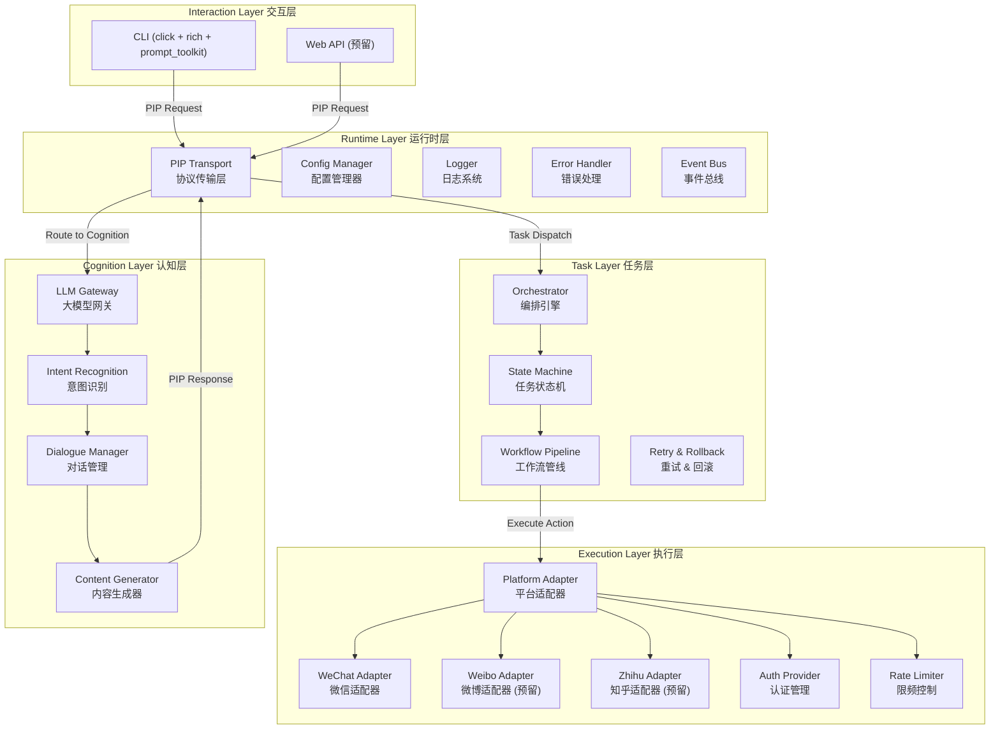
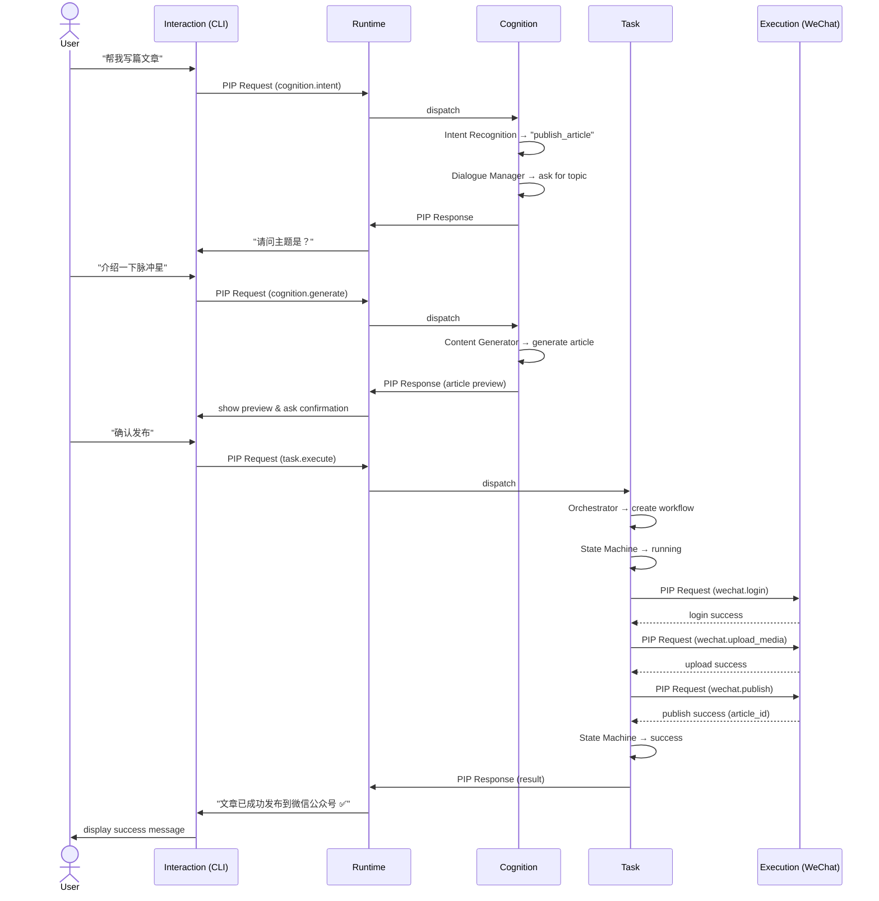

# Pulsar 架构文档

> 本文档详细描述 Pulsar 系统的整体架构、各层职责、层间通信机制以及核心数据流。

---

## 目录

1. [五层架构总览](#1-五层架构总览)
2. [各层详解](#2-各层详解)
   - [Runtime Layer](#21-runtime-layer-运行时层)
   - [Cognition Layer](#22-cognition-layer-认知层)
   - [Task Layer](#23-task-layer-任务层)
   - [Execution Layer](#24-execution-layer-执行层)
   - [Interaction Layer](#25-interaction-layer-交互层)
3. [层间通信：PIP 协议](#3-层间通信pip-协议)
4. [典型数据流：发布文章](#4-典型数据流发布文章)
5. [平台适配器模式](#5-平台适配器模式)
6. [扩展指南](#6-扩展指南)

---

## 1. 五层架构总览



---

## 2. 各层详解

### 2.1 Runtime Layer 运行时层

**职责：** 为整个系统提供基础运行时能力。

| 组件 | 说明 |
|------|------|
| **PIP Transport** | 基于 PIP（Pulsar Internal Protocol）实现层间通信，提供 JSON-RPC 风格的请求/响应和事件推送 |
| **Config Manager** | 读取并管理配置文件（YAML/TOML/环境变量），支持多环境（开发/测试/生产） |
| **Logger** | 结构化日志，支持不同等级（DEBUG/INFO/WARN/ERROR）和日志轮转 |
| **Error Handler** | 统一错误处理，将平台层、网络层等原始错误转换为 PIP 标准错误码 |
| **Event Bus** | 基于发布-订阅模式的事件总线，各层可监听与抛出事件 |

**设计原则：** Runtime 层对上层完全透明，上层只需通过 PIP 接口通信，不关心底层实现细节。

---

### 2.2 Cognition Layer 认知层

**职责：** 所有与 LLM 相关的智能推理与内容生成。

| 组件 | 说明 |
|------|------|
| **LLM Gateway** | 统一的大模型接入网关，支持多供应商（OpenAI / Anthropic / 本地模型），负责 Token 管理、流式输出、降级策略 |
| **Intent Recognition** | 分析用户自然语言输入，识别用户意图（如"发布文章"、"修改草稿"、"查看状态"） |
| **Dialogue Manager** | 管理多轮对话状态，维护上下文窗口，处理指代消解 |
| **Content Generator** | 基于用户意图和上下文，使用 LLM 生成文章内容、标题、摘要等 |

**设计原则：** 认知层不关心"哪个平台"或"怎么发布"，只关心"用户想做什么"和"应该生成什么内容"。

---

### 2.3 Task Layer 任务层

**职责：** 将高层的"意图"拆解为可执行的步骤序列，并管理执行状态。

| 组件 | 说明 |
|------|------|
| **Orchestrator** | 接收来自 Cognition 层的任务计划，解析为步骤 DAG（有向无环图） |
| **State Machine** | 管理每个任务的生命周期：`pending → running → success/failed → rollback` |
| **Workflow Pipeline** | 按序或并行执行步骤，支持条件分支和循环 |
| **Retry & Rollback** | 自动重试失败的步骤（指数退避），支持跨步骤的事务性回滚 |

**设计原则：** 任务层抽象了"执行逻辑"，一个"发布文章"任务可能包含多个子步骤（如登录→上传图片→发布正文→定时删除草稿），这些都由任务层编排。

---

### 2.4 Execution Layer 执行层

**职责：** 与具体社交媒体平台的 API 交互，封装平台差异。

| 组件 | 说明 |
|------|------|
| **Platform Adapter** | 抽象接口，定义所有平台必须实现的方法（`publish`、`upload_media`、`get_status`、`login` 等） |
| **WeChat Adapter** | 微信公众号平台适配器（Phase 1 唯一实现） |
| **Weibo Adapter** | 微博平台适配器（预留） |
| **Zhihu Adapter** | 知乎平台适配器（预留） |
| **Auth Provider** | 管理 OAuth 2.0 / API Key 等认证流程，支持 Token 刷新 |
| **Rate Limiter** | 平台级限频控制，防止触发 API 限流 |

**设计原则：** 执行层是唯一直接与外部 API 通信的层级。所有平台适配器实现同一个抽象接口，新增平台只需添加新的适配器实现，不影响上层。

---

### 2.5 Interaction Layer 交互层

**职责：** 面向用户提供交互界面，将用户输入转发给下游，并将结果呈现给用户。

| 组件 | 说明 |
|------|------|
| **CLI** | 基于 `click` + `rich` + `prompt_toolkit` 的交互式命令行界面，支持对话模式（REPL）和单次命令模式 |
| **Web API** | RESTful API 接口（预留），为未来 Web 前端或第三方集成做准备 |

**设计原则：** 交互层是系统的"脸面"，负责提供最优的用户体验，但不包含任何业务逻辑。

---

## 3. 层间通信：PIP 协议

所有层间通信均通过 **PIP（Pulsar Internal Protocol）** 进行。

### 3.1 PIP 消息格式

```json
{
  "jsonrpc": "2.0",
  "method": "layer.invoke",
  "params": {
    "layer": "cognition",
    "action": "generate_content",
    "context": {
      "session_id": "sess_abc123",
      "user_input": "帮我写一篇关于脉冲星的文章",
      "platform": "wechat"
    },
    "payload": {
      "style": "popular_science",
      "length": "medium"
    }
  },
  "id": "req_001"
}
```

### 3.2 层间路由

每条 PIP 消息在 Runtime Layer 的 PIP Transport 组件中经过路由器分发：

```
Interaction ──PIP──▶ Runtime (Router) ──▶ Cognition
                                               │
                                               ▼
Cognition ──PIP──▶ Runtime (Router) ──▶ Task
                                           │
                                           ▼
Task ──PIP──▶ Runtime (Router) ──▶ Execution
```

### 3.3 事件推送

除了请求/响应模式，PIP 也支持服务器推送事件：

```json
{
  "jsonrpc": "2.0",
  "method": "event.push",
  "params": {
    "type": "task.progress",
    "data": {
      "task_id": "task_001",
      "progress": 0.6,
      "status": "uploading_media",
      "message": "正在上传封面图片..."
    }
  }
}
```

---

## 4. 典型数据流：发布文章

以用户输入 `"帮我写篇文章"` 为例，说明完整的请求流：



### 4.1 步骤拆解

1. **意图识别** — Cognition 层分析"帮我写篇文章"，识别为 `publish_article` 意图
2. **多轮对话** — Cognition 层通过 Dialogue Manager 向用户追问主题、风格等信息
3. **内容生成** — 收集足够信息后，Cognition 层调用 LLM 生成完整文章
4. **用户确认** — 生成内容预览后，等待用户确认发布
5. **任务创建** — Task 层将"发布文章"拆解为子步骤：登录 → 上传媒体 → 发布
6. **执行子步骤** — Execution 层按序执行每个子步骤，Task 层跟踪状态
7. **结果返回** — 完成所有步骤后，最终结果逐层返回给用户

---

## 5. 平台适配器模式

### 5.1 适配器接口

```python
from abc import ABC, abstractmethod
from dataclasses import dataclass

@dataclass
class PublishResult:
    success: bool
    platform_post_id: str | None
    error: str | None

class PlatformAdapter(ABC):
    """所有平台适配器的抽象基类"""

    @abstractmethod
    async def login(self, credentials: dict) -> bool:
        ...

    @abstractmethod
    async def upload_media(self, file_path: str, media_type: str) -> str:
        """上传媒体文件，返回媒体 ID"""
        ...

    @abstractmethod
    async def publish(self, content: dict) -> PublishResult:
        """发布内容到平台"""
        ...

    @abstractmethod
    async def get_status(self, post_id: str) -> str:
        """查询发布状态"""
        ...

    @abstractmethod
    async def delete(self, post_id: str) -> bool:
        """删除已发布的内容"""
        ...
```

### 5.2 注册与发现

新平台只需继承 `PlatformAdapter` 并实现所有抽象方法，然后通过装饰器注册：

```python
from pulsar.execution import register_adapter

@register_adapter("wechat_official")
class WeChatOfficialAdapter(PlatformAdapter):
    async def login(self, credentials: dict) -> bool:
        # 微信公众号 OAuth 登录逻辑
        ...

    async def publish(self, content: dict) -> PublishResult:
        # 调用微信公众号发布 API
        ...
```

### 5.3 平台差异隔离

| 能力 | WeChat | Weibo（预留） | Zhihu（预留） |
|------|--------|---------------|---------------|
| 内容类型 | 图文、视频 | 图文、视频 | 文章、回答 |
| 认证方式 | OAuth 2.0 + Token | OAuth 2.0 | OAuth 2.0 + Cookie |
| 限频策略 | 每日 1 篇 | 每分钟 30 次 | 每小时 10 次 |
| 媒体上传 | 永久/临时素材 | 直接上传 | 图片/视频分离 |

所有差异封装在适配器内部，对外暴露统一的 `PlatformAdapter` 接口。

---

## 6. 扩展指南

### 6.1 新增平台

1. 在 `pulsar/execution/adapters/` 下创建新的适配器文件
2. 继承 `PlatformAdapter` 并实现所有抽象方法
3. 使用 `@register_adapter("platform_name")` 注册
4. 在配置文件中添加对应平台的认证信息

### 6.2 新增认知能力

1. 在 `pulsar/cognition/intents/` 下定义新的意图处理器
2. 实现 `handle()` 方法，返回结构化的意图数据
3. Task Layer 会根据意图数据自动编排对应的执行流程

### 6.3 新增交互方式

1. 在 `pulsar/interaction/` 下添加新的交互模块（如 Web API）
2. 通过 PIP 协议与 Runtime 层通信
3. 无需更改其他层级

---

> **Pulsar 架构设计核心思想：** 每一层只关心自己的事，通过 PIP 协议松耦合通信。这种设计使得各层可以独立演进、独立测试、独立部署，为未来多平台、多模态、多交互方式的支持奠定坚实的架构基础。
