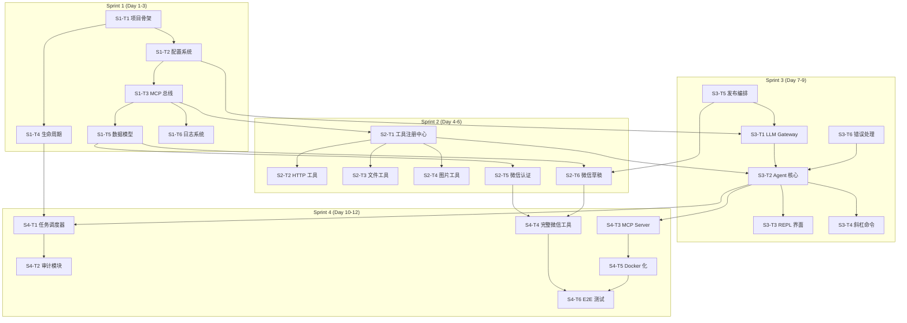

# Phase 1 计划 — 通过对话实现微信端到端发布骨架

## 一、Phase 1 目标

构建 Pulsar 项目的**最小可用骨架**，实现通过自然语言对话，完成从内容编写到微信公众号发布的端到端流程。Phase 1 不追求生产级完善，而是打通核心链路，验证架构可行性。

**核心能力：**
- 用户通过 REPL 对话描述文章需求
- Agent 调用 LLM Gateway 生成/润色内容
- Agent 通过工具链完成微信素材上传、草稿保存、发布
- 全流程可审计、可调度、可追踪

---

## 二、Sprint 规划

### Sprint 1（第 1–3 天）：项目脚手架、配置系统、MCP 总线、生命周期、数据模型

| 任务 ID | 任务描述 | 交付物 | 工时 |
|---------|---------|--------|------|
| S1-T1 | 初始化项目结构：`pulsar/` 顶层目录、Python 包、Makefile、`.gitignore`、`pyproject.toml` | 项目骨架 | 0.5d |
| S1-T2 | 配置系统：`config.yaml` 加载（Viper）、环境变量覆盖、配置热重载接口 | `pkg/config/` 包 | 1d |
| S1-T3 | MCP 总线（Message Control Protocol）核心：消息定义、Channel、Publisher/Subscriber 接口 | `src/pulsar/runtime/mcp_bus/` 包 | 0.5d |
| S1-T4 | 应用生命周期：启动/关闭信号处理、Graceful Shutdown、组件注册接口 | `src/pulsar/runtime/lifecycle/` 包 | 0.5d |
| S1-T5 | 核心数据模型：Article、Draft、User、PublishTask 的结构体定义与验证 | `src/pulsar/shared/models/` 包 | 0.5d |
| S1-T6 | 日志系统：结构化日志（slog/zerolog）、分级输出、日志轮转配置 | `src/pulsar/runtime/ (loguru)` 包 | 0.25d |
| S1-T7 | 单元测试与 Sprint 验证 | 测试覆盖核心包 | 0.25d |

### Sprint 2（第 4–6 天）：工具注册中心、内置工具、微信认证+草稿

| 任务 ID | 任务描述 | 交付物 | 工时 |
|---------|---------|--------|------|
| S2-T1 | 工具注册中心：Tool 接口定义、Registry 管理、工具元数据（名称、描述、参数 Schema） | `pkg/tools/` 包 | 1d |
| S2-T2 | HTTP 工具：`http_get` / `http_post`，支持请求构造、超时、响应解析 | `pkg/tools/builtins/http.go` | 0.5d |
| S2-T3 | 文件工具：`file_read` / `file_write`，沙箱路径限制，编码检测 | `pkg/tools/builtins/file.go` | 0.5d |
| S2-T4 | 图片工具：`image_download` / `image_compress`，URL 转 Base64/本地缓存 | `pkg/tools/builtins/image.go` | 0.5d |
| S2-T5 | 微信认证模块：OAuth2 令牌获取、令牌刷新、凭据安全存储 | `src/pulsar/execution/adapters/wechat/auth.go` | 0.5d |
| S2-T6 | 微信草稿 API：创建/更新/删除草稿、素材上传、草稿列表查询 | `src/pulsar/execution/adapters/wechat/draft.go` | 0.5d |
| S2-T7 | 集成测试与 Sprint 验证 | 测试 WeChat Adapter | 0.5d |

### Sprint 3（第 7–9 天）：对话 Agent REPL、LLM Gateway、斜杠命令、发布

| 任务 ID | 任务描述 | 交付物 | 工时 |
|---------|---------|--------|------|
| S3-T1 | LLM Gateway：多 Provider 抽象（DeepSeek / OpenAI），请求/响应适配、Token 计数 | `src/pulsar/gateway/` 包 | 1d |
| S3-T2 | Agent 核心：对话上下文管理、工具选择（Function Calling）、ReAct 循环 | `pkg/agent/` 包 | 1d |
| S3-T3 | REPL 界面：终端交互（promptui/readline）、彩色输出、多行输入、会话历史 | `cmd/pulsar/repl.go` | 0.5d |
| S3-T4 | 斜杠命令系统：`/help`、`/clear`、`/publish`、`/status`、`/exit` 注册与路由 | `pkg/agent/slash.go` | 0.25d |
| S3-T5 | 发布流程编排：对话理解 → 内容生成 → 草稿创建 → 预览 → 确认发布 | `pkg/workflow/publish.go` | 0.5d |
| S3-T6 | 错误处理与重试：LLM 调用失败回退、工具执行超时兜底、用户友好错误提示 | `pkg/agent/errors.go` | 0.25d |
| S3-T7 | 集成测试与 Sprint 验证 | 端到端对话测试 | 0.5d |

### Sprint 4（第 10–12 天）：任务调度器、审计、MCP Server、完整微信工具、E2E、Docker

| 任务 ID | 任务描述 | 交付物 | 工时 |
|---------|---------|--------|------|
| S4-T1 | 任务调度器：定时/延时任务、队列管理、任务状态持久化、失败重试 | `pkg/scheduler/` 包 | 1d |
| S4-T2 | 审计模块：操作日志记录、结构化审计事件、查询接口 | `pkg/audit/` 包 | 0.5d |
| S4-T3 | MCP Server：基于 gRPC/HTTP 的远程 MCP 总线，允许外部进程注册工具 | `cmd/pulsar/mcp_server.go` + `src/pulsar/runtime/mcp_bus/server.go` | 1d |
| S4-T4 | 完整微信工具：标签管理、菜单查询、粉丝消息、数据统计 | `src/pulsar/execution/adapters/wechat/` 补充 | 0.5d |
| S4-T5 | Docker 化：多阶段构建 Dockerfile、docker-compose.yml（含 Redis/MySQL 可选依赖） | `Dockerfile` + `docker-compose.yml` | 0.5d |
| S4-T6 | E2E 测试：从对话到发布的完整链路自动化测试 | `tests/e2e/` | 0.5d |
| S4-T7 | 文档与 Sprint 验证：README、架构图、API 文档、Sprint 回顾 | 项目文档 | 0.5d |

---

## 三、依赖关系图

---

## 四、验收标准（Acceptance Criteria）

- [ ] AC1: 项目可通过 `make build` 编译成功，`./pulsar --help` 输出正确的命令行帮助信息
- [ ] AC2: 加载自定义 `config.yaml` 后，所有配置项正确生效，环境变量覆盖正常工作
- [ ] AC3: MCP 总线支持至少 3 个组件同时通信，消息发布/订阅/取消订阅功能正常
- [ ] AC4: 工具注册中心可注册/注销工具，`http_get` 和 `file_read` 工具可被 Agent 调起并正确执行
- [ ] AC5: 微信适配器能完成认证令牌获取、草稿创建和素材上传（使用测试公众号）
- [ ] AC6: Agent REPL 启动后支持自然语言对话，输入"写一篇关于 AI 的文章并发布"可在 5 步内完成发布流程
- [ ] AC7: 整个流程的审计日志完整记录每一步操作，可通过审计查询接口检索

---

## 五、交付物清单（Deliverables）

- [ ] D1: 项目完整源码（`pulsar/` 顶层目录下所有 Go 包）
- [ ] D2: 配置文件模板（`config.example.yaml`）及所有配置项文档
- [ ] D3: `Makefile` 包含 `build`、`test`、`lint`、`run`、`docker` 目标
- [ ] D4: `Dockerfile` 多阶段构建 + `docker-compose.yml` 一键启动
- [ ] D5: 单元测试覆盖率 ≥ 60%（核心包 ≥ 80%）
- [ ] D6: E2E 自动化测试脚本
- [ ] D7: 项目 README（含架构图、快速开始、配置说明）
- [ ] D8: MCP Server API 文档（Protobuf / OpenAPI 规范）
- [ ] D9: Sprint 回顾报告（含完成/未完成任务、技术债务、改进建议）

---

## 六、风险评估

| 风险 | 概率 | 影响 | 缓解措施 |
|------|------|------|----------|
| **微信 API 变更** | 中 | 高 | 适配器层抽象，API 版本钉死，定期回归测试 |
| **LLM API 不稳定/限流** | 高 | 中 | 多 Provider 切换、指数退避重试、请求缓存 |
| **REPL 用户体验不佳** | 中 | 中 | Sprint 3 中期做可用性测试，预留 0.5d 优化时间 |
| **工具沙箱逃逸（文件读取）** | 低 | 高 | 路径白名单校验、Chroot/Jail 限制、代码审查 |
| **OAuth Token 泄露** | 低 | 高 | 凭据加密存储（AES-256）、运行时不落盘、密钥轮换 |
| **Sprint 任务估算偏差** | 中 | 中 | 每个 Sprint 预留 0.5d Buffer，优先级明确可砍范围 |
| **团队成员并行依赖阻塞** | 中 | 低 | Sprint 内任务设计为可并行，关键路径任务分配专人 |
| **Docker 镜像体积过大** | 低 | 低 | 多阶段构建、Alpine 基础镜像、Python 包构建 |

---

*本计划基于 12 个工作日、单人/小团队开发模式制定。实际执行可根据团队规模与优先级调整 Sprint 内容。*
