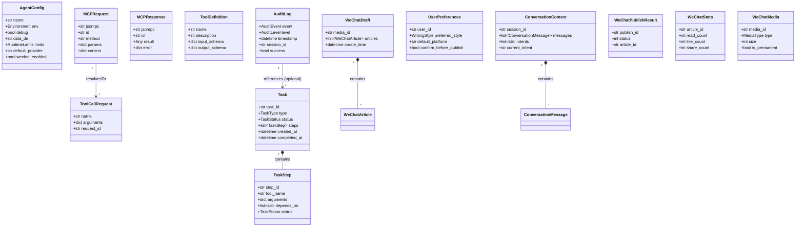

# Pulsar 数据模型文档

> 本文档定义了 Pulsar 系统中所有核心数据模型，全部基于 **Pydantic v2** 实现。
>
> 所有模型位于 `pulsar/models/` 目录下，遵循以下设计原则：
> - 使用 `pydantic.BaseModel` 并启用 `model_config = ConfigDict(frozen=True)` 实现不可变数据
> - 所有可选字段使用 `Optional` 明确标注
> - 字段描述使用 `Field(description="...")` 提供完整的文档信息
> - 枚举类型使用 `StrEnum`（Python 3.11+）或 `str, Enum` 联合

---

## 目录

1. [通用模型](#1-通用模型)
2. [PIP 通信模型](#2-pip-通信模型)
3. [PIP 通信模型](#3-pip-通信模型-pulsar-internal-protocol)
4. [ActionPlan 模型](#3-actionplan-模型)
5. [工具模型](#4-工具模型)
6. [任务模型](#5-任务模型)
7. [审计日志模型](#6-审计日志模型)
8. [对话模型](#7-对话模型)
9. [用户偏好模型](#8-用户偏好模型future)
10. [微信平台模型](#9-微信平台模型)

---

## 1. 通用模型

### 1.1 AgentConfig — Agent 配置模型

**文件:** `pulsar/models/agent_config.py`

```python
from pydantic import BaseModel, Field, ConfigDict
from typing import Optional
from datetime import datetime, timezone
import enum


class AgentStatus(str, enum.Enum):
    """Agent 运行状态枚举。"""
    INIT = "init"               # 初始化中，尚未就绪
    RUNNING = "running"         # 正常运行
    DEGRADED = "degraded"       # 部分组件异常
    STOPPED = "stopped"         # 已停止
    RESTARTING = "restarting"   # 正在重启


class LogLevel(str, enum.Enum):
    """日志级别枚举。"""
    DEBUG = "debug"
    INFO = "info"
    WARNING = "warning"
    ERROR = "error"
    FATAL = "fatal"


class Environment(str, enum.Enum):
    """运行环境枚举。"""
    DEVELOPMENT = "development"
    STAGING = "staging"
    PRODUCTION = "production"


class RuntimeLimits(BaseModel):
    """运行时资源限制配置模型。

    用于限制 Agent 运行时能使用的系统资源，防止失控行为。
    """
    model_config = ConfigDict(frozen=True)

    max_open_files: int = Field(
        default=1024,
        description="最大同时打开文件数。超出后新文件操作会阻塞等待。",
        ge=64,
        le=65536,
    )
    max_memory_mb: int = Field(
        default=512,
        description="最大内存使用量（MB）。设置为 0 表示不限制。",
        ge=0,
        le=32768,
    )
    max_tool_output_bytes: int = Field(
        default=10_485_760,  # 10 MB
        description="单次工具调用的输出最大字节数。超出部分将被截断。",
        ge=1024,
        le=1_073_741_824,
    )


class AgentConfig(BaseModel):
    """Agent 配置模型（对应 pulsar.yaml 完整配置）。

    该模型在 Agent 启动时从配置文件加载，运行时通过 Config Manager 管理。
    支持热重载：部分字段的修改无需重启进程即可生效。
    """
    model_config = ConfigDict(frozen=True)

    # ---- 系统配置 ----
    name: str = Field(
        default="pulsar",
        description="应用名称。影响日志文件名、审计标签、指标维度。"
    )
    env: Environment = Field(
        default=Environment.DEVELOPMENT,
        description="运行环境。影响日志级别、错误处理行为、调试输出。"
    )
    debug: bool = Field(
        default=False,
        description="调试模式开关。开启后输出更详细的日志和原始错误栈。"
    )
    data_dir: str = Field(
        default="./data",
        description="数据目录。存放草稿缓存、会话历史、工具临时文件、Token 持久化存储。"
    )
    timezone: str = Field(
        default="UTC",
        description="系统时区。影响日志时间戳和定时发布计算。格式: 时区名称如 Asia/Shanghai。"
    )
    pid_file: str = Field(
        default="/tmp/pulsar.pid",
        description="PID 文件路径。用于进程管理和单实例检测。"
    )

    # ---- 运行时配置 ----
    max_concurrency: int = Field(
        default=10,
        description="最大并发任务数。同时执行中的工具调用和 API 请求数量上限。",
        ge=1,
        le=100,
    )
    shutdown_timeout: int = Field(
        default=15,
        description="优雅关闭的超时时间（秒）。超时后强制终止未完成的任务。",
        ge=5,
        le=120,
    )
    health_check_interval: int = Field(
        default=30,
        description="健康检查间隔（秒）。HealthChecker 的探测频率。",
        ge=5,
        le=300,
    )
    task_timeout: int = Field(
        default=120,
        description="单个工具或 LLM 调用的最大等待时间（秒）。超时后触发重试。",
        ge=10,
        le=600,
    )
    limits: RuntimeLimits = Field(
        default_factory=RuntimeLimits,
        description="资源限制配置。",
    )

    # ---- LLM 网关配置 ----
    default_provider: str = Field(
        default="deepseek",
        description="默认使用的 LLM Provider 名称。需在 providers 列表中存在。"
    )

    # ---- 适配器配置 ----
    wechat_enabled: bool = Field(
        default=False,
        description="是否启用微信适配器。为 False 时不会加载 WeChatAdapter。"
    )

    # ---- 审计日志配置 ----
    audit_enabled: bool = Field(default=True, description="是否启用审计日志记录。")
    audit_level: LogLevel = Field(default=LogLevel.INFO, description="审计日志级别。")
    audit_output: str = Field(default="both", description="审计输出目标: stdout | file | both。")

    # ---- 交互配置 ----
    cli_enabled: bool = Field(default=True, description="是否启用 CLI/REPL 模式。")
    cli_prompt: str = Field(default="pulsar> ", description="CLI 提示符字符串。")
    cli_context_messages: int = Field(default=20, description="对话上下文保留的消息数量。")
    mcp_server_enabled: bool = Field(default=False, description="是否启用 MCP Server 模式。")

    # ---- 元数据 ----
    config_hash: str = Field(
        default="",
        description="配置文件内容的 SHA-256 哈希。用于热重载检测和审计追踪。"
    )
    loaded_at: datetime = Field(
        default_factory=datetime.utcnow,
        description="配置加载时间（UTC）。用于判断配置是否为最新。"
    )
```


## 2. PIP 通信模型（Pulsar Internal Protocol）

**文件:** `pulsar/models/pip.py`

PIP（Pulsar Internal Protocol）是 Pulsar **内部层间通信**的标准协议，基于 JSON-RPC 2.0 规范。与 MCP 模型的区别：
- MCP 模型用于外部 LLM 主机 ↔ Layer 5 MCP Server
- PIP 模型用于 Layer 5 ↔ Layer 4 ↔ Layer 3 ↔ Layer 2 ↔ Layer 1 内部通信

### 2.1 PIPRequest — 内部层间请求模型

```python
from pydantic import BaseModel, Field, ConfigDict
from typing import Any, Optional
from datetime import datetime, timezone


class PIPRequest(BaseModel):
    """PIP 协议请求模型。

    PIP 用于 Pulsar 内部层间通信，结构与 MCPRequest 相似，
    但使用 target 字段替代 method 的组件前缀，便于内部路由。
    """
    model_config = ConfigDict(frozen=True)

    jsonrpc: str = Field(
        default="2.0",
        description="JSON-RPC 协议版本。固定为 '2.0'。"
    )
    id: str = Field(
        ...,
        description="请求唯一标识符。格式: 'pip_' + UUID 前缀。"
    )
    target: str = Field(
        ...,
        description="目标层/组件标识。例如: 'layer2/intent'、'layer3/orchestrator'、'layer1/tool_registry'。"
    )
    method: str = Field(
        ...,
        description="要调用的方法名称。格式: '<组件>.<动作>'。"
    )
    params: dict = Field(
        default_factory=dict,
        description="方法参数。不同 method 有不同参数结构。"
    )
    context: Optional[dict] = Field(
        default=None,
        description="请求上下文。包含 session_id、user_id、trace_id 等跨层传递的信息。"
    )
    timestamp: datetime = Field(
        default_factory=datetime.utcnow,
        description="请求发起时间（UTC）。用于超时检测和性能分析。"
    )

    def is_notification(self) -> bool:
        """判断是否为通知消息（无需响应）。"""
        return self.id is None or self.id == ""
```

### 2.2 PIPResponse — 内部层间响应模型

```python
class PIPResponse(BaseModel):
    """PIP 协议响应模型。

    内部层间通信的响应，结构与 MCPResponse 一致，
    但由 PipBus 内部路由到对应等待中的请求处理器。
    """
    model_config = ConfigDict(frozen=True)

    jsonrpc: str = Field(
        default="2.0",
        description="JSON-RPC 协议版本。固定为 '2.0'。"
    )
    id: str = Field(
        ...,
        description="对应请求的 ID。用于匹配请求和响应。"
    )
    result: Optional[Any] = Field(
        default=None,
        description="调用结果。成功时返回具体数据，失败时为 None。"
    )
    error: Optional[dict] = Field(
        default=None,
        description="错误信息。失败时返回，包含 code 和 message 字段。"
    )
    timestamp: datetime = Field(
        default_factory=datetime.utcnow,
        description="响应生成时间（UTC）。"
    )

    def is_success(self) -> bool:
        """判断请求是否执行成功。"""
        return self.error is None

    def is_error(self) -> bool:
        """判断请求是否执行失败。"""
        return self.error is not None
```

### 2.3 PIPNotification — 通知（事件推送）模型

```python
class PIPNotification(BaseModel):
    """PIP 通知模型（服务器推送事件）。

    通知与请求的区别在于没有 id 字段，客户端不需要回复。
    """
    model_config = ConfigDict(frozen=True)

    jsonrpc: str = Field(default="2.0", description="JSON-RPC 协议版本。")
    method: str = Field(
        ...,
        description="事件类型。如 'event/publish'、'task.progress'。"
                    "事件类型命名规则: <域>.<事件名>。"
    )
    params: dict = Field(
        default_factory=dict,
        description="事件参数。包含 type、data 等字段。"
    )
```

### 2.4 PIPError — 错误模型

```python
class PIPError(BaseModel):
    """PIP 错误模型。

    标准 JSON-RPC 错误码:
        -32700: 解析错误（JSON 格式不正确）
        -32600: 无效请求
        -32601: 方法未找到
        -32602: 无效参数
        -32603: 内部错误
        -32000 ~ -32099: 服务器端自定义错误

    Pulsar 自定义错误码:
        -32100: 层间路由错误（目标层不可达）
        -32101: 时间超时
        -32102: 认证失败
        -32103: 权限不足
        -32104: 工具执行错误
        -32105: LLM 调用错误（返回不符合预期格式）
        -32106: 平台适配器错误（微信 API 返回错误）
        -32107: 资源限制（超出限频或配额）
    """
    model_config = ConfigDict(frozen=True)

    code: int = Field(
        ...,
        description="错误码。遵循 JSON-RPC 2.0 标准 + Pulsar 自定义扩展。"
    )
    message: str = Field(
        ...,
        description="人类可读的错误描述（中文）。"
    )
    data: Optional[dict] = Field(
        default=None,
        description="错误的附加信息。包含 errcode、stack_trace、retry_after 等调试信息。"
    )
```

---

## 3. ActionPlan 模型

**文件:** `pulsar/models/pip.py`（与 PIP 模型同文件）

ActionPlan 是 Layer 2 Intent Recognition 产出的执行计划，由 Layer 3 Orchestrator 消费。

### 3.1 ActionPlan — 执行计划模型

```python
from pydantic import BaseModel, Field, ConfigDict
from typing import Any, Optional
from datetime import datetime, timezone


class ActionStep(BaseModel):
    """执行计划中的单个步骤。"""
    model_config = ConfigDict(frozen=True)

    tool: str = Field(
        ...,
        description="工具名称，如 'shell/execute'、'wechat.create_draft'。"
    )
    params: dict = Field(
        default_factory=dict,
        description="工具调用参数。"
    )
    description: str = Field(
        default="",
        description="这一步做什么（自然语言描述）。"
    )
    depends_on: list[int] = Field(
        default_factory=list,
        description="依赖的步骤索引（从 0 开始）。执行前需确保所有依赖步骤已完成。"
    )


class ActionPlan(BaseModel):
    """执行计划模型。

    Layer 2 意图识别产出→Layer 3 编排器消费的完整执行计划。
    """
    model_config = ConfigDict(frozen=True)

    workflow_id: str = Field(
        ...,
        description="工作流唯一标识。格式: 'wf_' + UUID（8 位十六进制）。"
                    "用于追踪 ActionPlan 的完整生命周期。"
    )
    steps: list[ActionStep] = Field(
        ...,
        description="执行步骤列表。按依赖关系拓扑排序。"
    )
    user_intent: str = Field(
        ...,
        description="用户意图描述。自然语言形式，如 '在微信公众号发布一篇关于脉冲星的文章'。"
    )
    confidence: float = Field(
        ...,
        description="意图识别置信度（0.0 ~ 1.0）。低于阈值时需用户确认。",
        ge=0.0,
        le=1.0,
    )
    created_at: datetime = Field(
        default_factory=datetime.utcnow,
        description="ActionPlan 创建时间（UTC）。"
    )
```

---

## 4. 工具模型

**文件:** `pulsar/models/tool.py`

### 4.1 ToolDefinition — 工具定义模型

```python
from pydantic import BaseModel, Field, ConfigDict
from typing import Any, Optional
from datetime import datetime, timezone


class ToolDefinition(BaseModel):
    """工具定义模型。

    描述一个可被 LLM 或上层系统调用的工具。
    对应 PIP 协议中 tools/list 返回的每个工具条目。
    """
    model_config = ConfigDict(frozen=True)

    name: str = Field(
        ...,
        description="工具名称。全局唯一，格式为 '<域>.<动作>'。"
                    "例如: wechat.create_draft、file_read、http_request。"
                    "命名规则: 小写字母 + 下划线，不得包含空格。"
        pattern=r"^[a-z][a-z0-9_]*(\.[a-z][a-z0-9_]*)*$",
    )
    description: str = Field(
        ...,
        description="工具描述。供 LLM 理解工具用途和何时使用。"
                    "应包含使用场景、限制条件和注意事项。"
    )
    input_schema: dict = Field(
        ...,
        description="输入参数的 JSON Schema（Draft-07 标准）。"
                    "包含 type、properties、required 等字段。"
                    "LLM 根据此 Schema 生成正确的参数。"
    )
    output_schema: dict = Field(
        default_factory=dict,
        description="输出结果的 JSON Schema。可选，用于上层校验返回数据。"
    )
    category: str = Field(
        default="",
        description="工具分类标签。用于分组和过滤，如 'wechat'、'file'、'network'。"
    )
    version: str = Field(
        default="1.0.0",
        description="工具版本号。遵循语义化版本规范。修改 input_schema 时需要升级。"
    )
    created_at: datetime = Field(
        default_factory=datetime.utcnow,
        description="工具注册时间。"
    )
```

### 4.2 ToolCallRequest — 工具调用请求模型

```python
class ToolCallRequest(BaseModel):
    """工具调用请求模型。

    对应 PIP 协议中 tools/call 请求的参数体。
    从请求中解析出的结构化工具调用信息。
    """
    model_config = ConfigDict(frozen=True)

    name: str = Field(
        ...,
        description="要调用的工具名称。必须对应一个已注册的 ToolDefinition。"
    )
    arguments: dict = Field(
        default_factory=dict,
        description="工具参数。键值对形式，键和值的结构由对应工具的 input_schema 定义。"
    )
    request_id: str = Field(
        ...,
        description="原始请求 ID。用于追踪工具调用链。格式: 'req_' + UUID。"
    )
    trace_id: str = Field(
        default="",
        description="全链路追踪 ID。在微服务/多进程场景下用于串联所有相关调用。"
    )
    session_id: str = Field(
        default="",
        description="会话 ID。关联到具体的用户对话会话。"
    )
    timestamp: datetime = Field(
        default_factory=datetime.utcnow,
        description="请求时间戳。"
    )


class ToolCallResult(BaseModel):
    """工具调用结果模型。
    """
    model_config = ConfigDict(frozen=True)

    name: str = Field(..., description="工具名称。")
    success: bool = Field(..., description="是否执行成功。")
    data: Any = Field(default=None, description="执行返回的数据。")
    error: Optional[str] = Field(default=None, description="执行失败时的错误信息。")
    duration_ms: int = Field(default=0, description="执行耗时（毫秒）。")
    request_id: str = Field(..., description="对应的请求 ID。")
    timestamp: datetime = Field(default_factory=datetime.utcnow, description="完成时间戳。")
```

---

## 5. 任务模型

**文件:** `pulsar/models/task.py`

### 5.1 TaskStatus — 任务状态枚举

```python
import enum


class TaskStatus(str, enum.Enum):
    """任务生命周期状态枚举。

    任务状态转换图:
    ┌──────────┐
    │  PENDING  │ ── 任务已创建但尚未开始执行
    └────┬─────┘
         │
         ▼
    ┌──────────┐
    │  RUNNING  │ ── 任务正在执行中（可能包含多个子步骤）
    └────┬─────┘
         │
         ├──────────────────┐
         ▼                  ▼
    ┌──────────┐      ┌──────────┐
    │  SUCCESS  │      │  FAILED   │ ── 任务执行失败（不可恢复）
    └──────────┘      └────┬─────┘
                           │
                           ▼
                      ┌──────────┐
                      │ ROLLBACK │ ── 已执行回滚操作
                      └──────────┘

    此外还有两个临时状态:
    - CANCELLED: 用户主动取消
    - TIMEOUT: 任务超过最大执行时间
    """
    PENDING = "pending"        # 等待执行
    RUNNING = "running"        # 执行中
    SUCCESS = "success"        # 执行成功
    FAILED = "failed"          # 执行失败
    CANCELLED = "cancelled"    # 已取消
    TIMEOUT = "timeout"        # 执行超时
    ROLLBACK = "rollback"      # 已回滚
    ROLLING_BACK = "rolling_back"  # 正在回滚中


class TaskPriority(str, enum.Enum):
    """任务优先级枚举。"""
    LOW = "low"                # 低优先级（如定时任务、数据清理）
    NORMAL = "normal"          # 普通优先级（默认）
    HIGH = "high"              # 高优先级（如用户交互操作）
    CRITICAL = "critical"      # 紧急优先级（如系统恢复）


class TaskType(str, enum.Enum):
    """任务类型枚举。"""
    PUBLISH_ARTICLE = "publish_article"          # 发布文章
    UPLOAD_MEDIA = "upload_media"                # 上传素材
    DELETE_POST = "delete_post"                  # 删除已发布内容
    SCHEDULE_PUBLISH = "schedule_publish"         # 定时发布
    UPDATE_DRAFT = "update_draft"                # 修改草稿
    SEND_MESSAGE = "send_message"                # 发送模板消息
    SYNC_DATA = "sync_data"                      # 同步数据
    CUSTOM = "custom"                            # 自定义任务
```

### 5.2 Task — 任务模型

```python
from pydantic import BaseModel, Field, ConfigDict
from typing import Any, Optional
from datetime import datetime, timezone


class TaskStep(BaseModel):
    """任务步骤模型。

    一个 Task 由多个 TaskStep 组成，按序或并行执行。
    """
    model_config = ConfigDict(frozen=True)

    step_id: str = Field(
        ...,
        description="步骤唯一标识。格式: 'step_' + UUID。"
    )
    name: str = Field(
        ...,
        description="步骤名称。如 '上传封面图片'、'创建草稿'。"
    )
    tool_name: str = Field(
        ...,
        description="执行此步骤需要调用的工具名称。"
    )
    arguments: dict = Field(
        default_factory=dict,
        description="工具调用参数。"
    )
    depends_on: list[str] = Field(
        default_factory=list,
        description="依赖的步骤 ID 列表。所有依赖步骤执行成功后才能执行本步骤。"
    )
    retry_count: int = Field(
        default=0,
        description="已重试次数。"
    )
    max_retries: int = Field(
        default=3,
        description="最大重试次数。超过后步骤标记为失败。"
    )
    status: TaskStatus = Field(
        default=TaskStatus.PENDING,
        description="步骤当前状态。"
    )
    result: Optional[Any] = Field(
        default=None,
        description="步骤执行结果。失败时包含错误信息。"
    )
    started_at: Optional[datetime] = Field(default=None, description="步骤开始执行时间。")
    completed_at: Optional[datetime] = Field(default=None, description="步骤完成时间。")
    duration_ms: int = Field(default=0, description="步骤执行耗时（毫秒）。")


class Task(BaseModel):
    """任务模型。

    代表一个可追踪的工作单元，由 Orchestrator 创建并管理。
    一个"发布文章"操作可能包含多个 TaskStep。
    """
    model_config = ConfigDict(frozen=True)

    task_id: str = Field(
        ...,
        description="任务唯一标识。格式: 'task_' + UUID（8 位十六进制）。"
                    "例如: task_a1b2c3d4。"
    )
    type: TaskType = Field(
        ...,
        description="任务类型。决定了任务的编排逻辑和默认参数。"
    )
    status: TaskStatus = Field(
        default=TaskStatus.PENDING,
        description="任务当前状态。"
    )
    priority: TaskPriority = Field(
        default=TaskPriority.NORMAL,
        description="任务优先级。影响调度顺序。"
    )
    title: str = Field(
        default="",
        description="任务标题。供用户界面显示。如 '发布文章: 宇宙的灯塔'。"
    )
    description: str = Field(
        default="",
        description="任务描述。包含任务目的和关键参数的 JSON 摘要。"
    )

    # ---- 步骤管理 ----
    steps: list[TaskStep] = Field(
        default_factory=list,
        description="任务步骤列表。步骤按顺序排列，执行前需解析依赖关系。"
    )

    # ---- 上下文 ----
    session_id: str = Field(
        default="",
        description="创建此任务的会话 ID。用于追溯用户交互历史。"
    )
    platform: str = Field(
        default="",
        description="目标平台标识。如 'wechat'、'weibo'。"
    )
    metadata: dict = Field(
        default_factory=dict,
        description="任务元数据。用于存储任意附加信息，如草稿 media_id、发布结果等。"
    )

    # ---- 时间 ----
    created_at: datetime = Field(
        default_factory=datetime.utcnow,
        description="任务创建时间（UTC）。"
    )
    started_at: Optional[datetime] = Field(
        default=None,
        description="任务开始执行时间（UTC）。"
    )
    completed_at: Optional[datetime] = Field(
        default=None,
        description="任务完成时间（UTC）。包括成功、失败、取消、超时。"
    )
    scheduled_at: Optional[datetime] = Field(
        default=None,
        description="定时执行时间（UTC）。为空表示立即执行。"
    )
    timeout_at: Optional[datetime] = Field(
        default=None,
        description="超时截止时间（UTC）。到达此时间后任务强制标记为 TIMEOUT。"
    )

    # ---- 结果 ----
    result: Optional[Any] = Field(
        default=None,
        description="任务最终结果。成功时包含平台返回的数据。"
    )
    error: Optional[str] = Field(
        default=None,
        description="任务错误信息。失败时包含人类可读的错误描述。"
    )
    error_code: Optional[str] = Field(
        default=None,
        description="任务错误码。供程序判断错误类型（如 'WECHAT_API_ERROR'）。"
    )

    # ---- 统计 ----
    total_duration_ms: int = Field(
        default=0,
        description="任务总耗时（毫秒）。从 started_at 到 completed_at。"
    )
    retry_count: int = Field(
        default=0,
        description="任务级别重试次数（整体重试）。"
    )

    # ---- 方法 ----
    def progress(self) -> float:
        """计算任务完成进度（0.0 ~ 1.0）。"""
        if not self.steps:
            return 1.0 if self.status == TaskStatus.SUCCESS else 0.0
        completed = sum(1 for s in self.steps
                        if s.status in (TaskStatus.SUCCESS, TaskStatus.FAILED))
        return completed / len(self.steps)

    def is_terminal(self) -> bool:
        """判断任务是否处于终态。"""
        return self.status in (
            TaskStatus.SUCCESS,
            TaskStatus.FAILED,
            TaskStatus.CANCELLED,
            TaskStatus.TIMEOUT,
            TaskStatus.ROLLBACK,
        )
```

---

## 6. 审计日志模型

**文件:** `pulsar/models/audit.py`

### 6.1 AuditEvent — 审计事件枚举

```python
import enum


class AuditEvent(str, enum.Enum):
    """审计事件类型枚举。

    命名规则: <组件>.<动作>
    """
    # Agent 生命周期
    AGENT_START = "agent.start"             # Agent 启动
    AGENT_STOP = "agent.stop"               # Agent 停止
    AGENT_RESTART = "agent.restart"         # 心跳检测触发重启

    # LLM 调用
    LLM_REQUEST = "llm.request"             # LLM 调用开始
    LLM_RESPONSE = "llm.response"           # LLM 调用结束
    LLM_ERROR = "llm.error"                 # LLM 调用失败

    # 工具调用
    TOOL_CALL = "tool.call"                 # 工具调用开始
    TOOL_RESULT = "tool.result"             # 工具调用结束
    TOOL_ERROR = "tool.error"               # 工具调用失败

    # 平台操作
    PLATFORM_LOGIN = "platform.login"       # 平台登录
    PLATFORM_PUBLISH = "platform.publish"   # 平台发布内容
    PLATFORM_DELETE = "platform.delete"     # 平台删除内容
    PLATFORM_UPLOAD = "platform.upload"     # 平台上传素材
    PLATFORM_ERROR = "platform.error"       # 平台 API 错误

    # 配置
    CONFIG_RELOAD = "config.reload"         # 配置热重载
    CONFIG_CHANGE = "config.change"         # 配置手动修改

    # 系统
    SYSTEM_ERROR = "system.error"           # 未分类错误
    SYSTEM_WARNING = "system.warning"       # 系统警告


class AuditLevel(str, enum.Enum):
    """审计级别枚举。"""
    DEBUG = "debug"
    INFO = "info"
    WARN = "warn"
    ERROR = "error"
```

### 6.2 AuditLog — 审计日志条目模型

```python
from pydantic import BaseModel, Field, ConfigDict
from typing import Any, Optional
from datetime import datetime, timezone


class AuditLog(BaseModel):
    """审计日志条目模型。

    每次关键操作生成一条审计日志记录，保存到 JSON Lines 文件。
    所有审计日志不可变（frozen=True），写入后不得修改。
    """
    model_config = ConfigDict(frozen=True)

    # ---- 核心字段 ----
    event: AuditEvent = Field(
        ...,
        description="审计事件类型。标识发生的操作类别。"
    )
    level: AuditLevel = Field(
        default=AuditLevel.INFO,
        description="日志级别。根据事件的严重程度设置。"
    )
    timestamp: datetime = Field(
        default_factory=datetime.utcnow,
        description="事件发生时间（UTC）。精确到毫秒。"
    )

    # ---- 关联信息 ----
    session_id: str = Field(
        default="",
        description="关联的会话 ID。用于将同一次交互的多个审计事件串联。"
    )
    task_id: str = Field(
        default="",
        description="关联的任务 ID。如果此事件是任务执行的一部分。"
    )
    request_id: str = Field(
        default="",
        description="关联的请求 ID。用于追踪 PIP 请求链路。"
    )
    user_id: str = Field(
        default="system",
        description="触发此操作的用户标识。'system' 表示系统自动操作。"
    )

    # ---- 操作详情 ----
    action: str = Field(
        default="",
        description="具体操作名称。如 'publish_draft'、'chat'。"
    )
    resource: str = Field(
        default="",
        description="操作的资源标识。如 'media_id:abc123'、'article:宇宙的灯塔'。"
    )
    details: dict = Field(
        default_factory=dict,
        description="操作的详细信息。包含请求参数摘要、响应摘要等。"
                    "注意：不存储敏感信息（如 Token、密码）。"
    )

    # ---- 结果 ----
    success: bool = Field(
        default=True,
        description="操作是否成功。"
    )
    error_message: Optional[str] = Field(
        default=None,
        description="操作失败时的错误信息。"
    )
    error_code: Optional[str] = Field(
        default=None,
        description="操作失败时的错误码。如 'WECHAT_40001'、'TIMEOUT'。"
    )

    # ---- 性能 ----
    duration_ms: Optional[int] = Field(
        default=None,
        description="操作耗时（毫秒）。对于长时间操作很有价值。"
    )

    # ---- 序列化 ----
    def to_json_line(self) -> str:
        """将审计日志序列化为 JSON Lines 格式字符串。

        返回:
            单行 JSON 字符串，末尾带 \\n。
        """
        import json
        data = self.model_dump()
        data["event"] = self.event.value
        data["level"] = self.level.value
        # 将 datetime 转换为 ISO 格式
        data["timestamp"] = self.timestamp.isoformat()
        return json.dumps(data, ensure_ascii=False, default=str) + "\n"
```

---

## 7. 对话模型

**文件:** `pulsar/models/conversation.py`

### 7.1 ConversationRole — 对话角色枚举

```python
import enum


class ConversationRole(str, enum.Enum):
    """对话消息角色枚举。"""
    SYSTEM = "system"                 # 系统提示词
    USER = "user"                     # 用户消息
    ASSISTANT = "assistant"           # Agent 回复
    TOOL = "tool"                     # 工具调用结果
    FUNCTION = "function"             # 函数调用（兼容旧格式）
```

### 7.2 ConversationMessage — 对话消息模型

```python
from pydantic import BaseModel, Field, ConfigDict
from typing import Any, Optional
from datetime import datetime, timezone


class ConversationMessage(BaseModel):
    """单条对话消息模型。

    对应 LLM Chat API（如 OpenAI）中的一条 message。
    """
    model_config = ConfigDict(frozen=True)

    role: ConversationRole = Field(
        ...,
        description="消息角色: system/user/assistant/tool/function。"
    )
    content: str | None = Field(
        ...,
        description="消息内容。tool 角色时可为空（使用 tool_call_id 关联）。"
    )
    name: Optional[str] = Field(
        default=None,
        description="发送者名称。用于区分不同用户或多 Agent 场景。"
    )
    tool_call_id: Optional[str] = Field(
        default=None,
        description="工具调用 ID。仅 tool 角色使用，关联到 assistant 发起的工具调用。"
    )
    tool_calls: Optional[list[dict]] = Field(
        default=None,
        description="工具调用列表。仅 assistant 角色使用，LLM 发起的并行工具调用。"
    )
    timestamp: datetime = Field(
        default_factory=datetime.utcnow,
        description="消息时间戳。"
    )
    tokens: Optional[int] = Field(
        default=None,
        description="此消息包含的 Token 数（仅系统计算，非 LLM 返回）。"
    )
```

### 7.3 ConversationContext — 对话上下文模型

```python
from pydantic import BaseModel, Field, ConfigDict, field_validator
from typing import Optional
from datetime import datetime, timezone


class ConversationContext(BaseModel):
    """对话上下文模型。

    维护多轮对话的状态和历史记录。由 Cognition 层的 Dialogue Manager 使用。
    """
    model_config = ConfigDict(frozen=True)

    session_id: str = Field(
        ...,
        description="会话唯一标识。格式: 'sess_' + UUID（8 位十六进制）。"
                    "例如: sess_f1e2d3c4。"
    )
    messages: list[ConversationMessage] = Field(
        default_factory=list,
        description="对话历史消息列表。按时间正序排列。"
    )

    # ---- 状态 ----
    intents: list[str] = Field(
        default_factory=list,
        description="本次会话中已识别的用户意图列表。按识别时间正序排列。"
    )
    current_intent: Optional[str] = Field(
        default=None,
        description="当前正在处理的用户意图。"
    )
    collected_info: dict = Field(
        default_factory=dict,
        description="已收集的用户偏好信息。如主题、风格、长度等。"
                    "格式: {'key': {'value': ..., 'source': 'user_input'} }"
    )

    # ---- 元数据 ----
    platform: str = Field(
        default="",
        description="本次对话关联的目标平台。如 'wechat'。"
    )
    user_id: str = Field(
        default="",
        description="关联的用户标识。"
    )
    created_at: datetime = Field(
        default_factory=datetime.utcnow,
        description="会话创建时间。"
    )
    updated_at: datetime = Field(
        default_factory=datetime.utcnow,
        description="会话最后更新时间。每次添加消息后更新。"
    )
    expired_at: Optional[datetime] = Field(
        default=None,
        description="会话过期时间。过期后会话被归档。默认创建后 24 小时过期。"
    )
    token_count: int = Field(
        default=0,
        description="当前会话的总 Token 消耗（截止到最近一次 LLM 调用）。"
    )

    # ---- 配置 ----
    max_messages: int = Field(
        default=50,
        description="最大保留消息数。超出后进行滑动窗口裁剪。"
    )
    max_tokens: int = Field(
        default=128_000,
        description="最大 Token 数。超出时执行上下文压缩或裁剪。"
    )

    # ---- 校验 ----
    @field_validator('messages')
    @classmethod
    def check_token_limit(cls, messages: list) -> list:
        """验证消息数不超过上限。"""
        if len(messages) > 200:
            raise ValueError("消息数超过 200 条上限")
        return messages

    # ---- 方法 ----
    def add_message(self, message: ConversationMessage) -> "ConversationContext":
        """添加消息到对话历史，自动管理窗口。

        当消息数超过 max_messages 时，移除最早的消息（保留 system 角色消息）。
        """
        import copy
        new_messages = list(self.messages) + [message]

        # 滑动窗口裁剪
        system_messages = [m for m in new_messages if m.role == ConversationRole.SYSTEM]
        non_system = [m for m in new_messages if m.role != ConversationRole.SYSTEM]

        while len(new_messages) > self.max_messages and len(non_system) > 1:
            non_system.pop(0)
            new_messages = system_messages + non_system

        return ConversationContext(
            session_id=self.session_id,
            messages=new_messages,
            intents=list(self.intents),
            current_intent=self.current_intent,
            collected_info=dict(self.collected_info),
            platform=self.platform,
            user_id=self.user_id,
            created_at=self.created_at,
            updated_at=datetime.now(timezone.utc),
            expired_at=self.expired_at,
            token_count=self.token_count,
            max_messages=self.max_messages,
            max_tokens=self.max_tokens,
        )

    def get_recent_messages(self, count: int = 10) -> list[ConversationMessage]:
        """获取最近的 N 条消息（不包含 system 消息）。"""
        non_system = [m for m in self.messages if m.role != ConversationRole.SYSTEM]
        return non_system[-count:]
```

---

## 8. 用户偏好模型（Future）

**文件:** `pulsar/models/preferences.py`

> **Phase 2 规划。** 目前用户偏好通过对话上下文中的 `collected_info` 动态收集。

### 8.1 UserPreferences — 用户偏好模型

```python
from pydantic import BaseModel, Field, ConfigDict
from typing import Optional
from datetime import datetime, timezone


class WritingStyle(str, enum.Enum):
    """写作风格枚举。"""
    POPULAR_SCIENCE = "popular_science"      # 科普风
    FORMAL = "formal"                        # 正式/专业
    CASUAL = "casual"                        # 轻松/口语化
    NEWS = "news"                            # 新闻风
    STORY = "story"                          # 故事叙述
    MARKETING = "marketing"                  # 营销/推广


class ContentLength(str, enum.Enum):
    """内容长度枚举。"""
    SHORT = "short"           # 短文（~500 字）
    MEDIUM = "medium"         # 中篇（~1500 字）
    LONG = "long"             # 长篇（~3000 字）
    EXTRA_LONG = "extra_long" # 超长（~5000 字）


class UserPreferences(BaseModel):
    """用户偏好模型。

    存储用户在写作、发布、交互方面的个性化偏好。
    当前通过对话动态感知，Phase 2 支持持久化存储。
    """
    model_config = ConfigDict(frozen=True)

    user_id: str = Field(
        default="default",
        description="用户标识。用于多用户场景下的偏好隔离。"
    )

    # ---- 写作偏好 ----
    preferred_style: WritingStyle = Field(
        default=WritingStyle.POPULAR_SCIENCE,
        description="默认写作风格。新文章默认使用此风格。"
    )
    preferred_length: ContentLength = Field(
        default=ContentLength.MEDIUM,
        description="默认内容长度。不指定长度时使用此值。"
    )
    default_author: str = Field(
        default="Pulsar",
        description="默认文章作者名。"
    )
    auto_generate_digest: bool = Field(
        default=True,
        description="是否自动生成文章摘要。为 False 时需要用户手动输入。"
    )
    open_comment_by_default: bool = Field(
        default=True,
        description="新文章默认是否开启评论。"
    )

    # ---- 发布偏好 ----
    default_platform: str = Field(
        default="wechat",
        description="默认发布平台。"
    )
    confirm_before_publish: bool = Field(
        default=True,
        description="发布前是否需要用户确认。为 False 时在生成后自动发布。"
    )
    auto_save_draft: bool = Field(
        default=True,
        description="是否在编辑过程中自动保存草稿。"
    )
    draft_auto_save_interval: int = Field(
        default=60,
        description="草稿自动保存间隔（秒）。"
    )

    # ---- 交互偏好 ----
    verbose_output: bool = Field(
        default=True,
        description="是否显示详细输出（包含中间步骤和调试信息）。"
    )
    language: str = Field(
        default="zh-CN",
        description="用户语言偏好。影响 Agent 回复的语言。"
    )

    # ---- 元数据 ----
    created_at: datetime = Field(
        default_factory=datetime.utcnow,
        description="偏好创建时间。"
    )
    updated_at: datetime = Field(
        default_factory=datetime.utcnow,
        description="偏好最后更新时间。"
    )
```

---

## 9. 微信平台模型

**文件:** `pulsar/models/wechat.py`

### 9.1 WeChatDraft — 微信草稿模型

```python
from pydantic import BaseModel, Field, ConfigDict
from typing import Optional, Any
from datetime import datetime, timezone


class WeChatArticle(BaseModel):
    """微信草稿中的单篇文章模型。"""
    model_config = ConfigDict(frozen=True)

    title: str = Field(
        ...,
        description="文章标题。长度限制: 1-64 字符。超出会被截断。",
        max_length=64,
        min_length=1,
    )
    author: str = Field(
        default="",
        description="文章作者。长度限制: 1-8 字符。",
        max_length=8,
    )
    digest: str = Field(
        default="",
        description="文章摘要。不填则自动从正文前 120 字截取。",
        max_length=120,
    )
    content: str = Field(
        ...,
        description="文章正文 HTML。图片使用  引用。"
                    "大小限制: ≤ 200KB（UTF-8 编码后）。"
    )
    cover_media_id: str = Field(
        ...,
        description="封面图片的 media_id。需先通过 upload_permanent_image 上传。"
    )
    need_open_comment: int = Field(
        default=0,
        description="是否打开评论: 0=关闭, 1=开启。",
        ge=0,
        le=1,
    )
    only_fans_can_comment: int = Field(
        default=0,
        description="是否仅粉丝可评论: 0=所有人可评论, 1=仅粉丝可评论。",
        ge=0,
        le=1,
    )
    need_show_cover: int = Field(
        default=1,
        description="是否在正文中显示封面图: 0=不显示, 1=显示。",
        ge=0,
        le=1,
    )
    content_source_url: str = Field(
        default="",
        description="原文链接 URL。可选的，用于注明文章来源。",
    )
    category_id: Optional[int] = Field(
        default=None,
        description="文章分类 ID。"
    )
    pic_crop_235_1: Optional[str] = Field(
        default=None,
        description="封面裁剪坐标（2.35:1 比例）。格式: 'x1,y1,x2,y2'。"
    )
    pic_crop_1_1: Optional[str] = Field(
        default=None,
        description="封面裁剪坐标（1:1 比例）。格式: 'x1,y1,x2,y2'。"
    )


class WeChatDraft(BaseModel):
    """微信公众号图文草稿模型。

    对应微信草稿箱 API 返回的草稿数据结构。
    """
    model_config = ConfigDict(frozen=True)

    media_id: str = Field(
        ...,
        description="草稿的唯一标识符（media_id）。用于后续的修改、发布等操作。"
    )
    articles: list[WeChatArticle] = Field(
        ...,
        description="草稿中的图文列表。最多 8 篇（多图文）。"
    )
    create_time: datetime = Field(
        ...,
        description="草稿创建时间。"
    )
    update_time: datetime = Field(
        ...,
        description="草稿最后修改时间。"
    )
    account_appid: str = Field(
        default="",
        description="草稿所属的公众号 AppID。"
    )

    # ---- 预览 ----
    preview_url: Optional[str] = Field(
        default=None,
        description="草稿预览 URL。可通过此链接在微信内预览草稿效果。"
    )

    def article_count(self) -> int:
        """返回草稿中的图文数量。"""
        return len(self.articles)
```

### 9.2 WeChatPublishResult — 发布结果模型

```python
from pydantic import BaseModel, Field, ConfigDict
from typing import Optional
from datetime import datetime, timezone


class WeChatPublishResult(BaseModel):
    """微信公众号发布结果模型。

    对应 freepublish/submit 和 freepublish/get 接口的返回数据。
    """
    model_config = ConfigDict(frozen=True)

    publish_id: str = Field(
        ...,
        description="发布任务 ID。用于后续查询发布状态。"
                    "格式: 数字字符串。"
    )
    msg_data_id: str = Field(
        default="",
        description="消息数据 ID。可用于数据统计接口查询文章数据。"
    )
    status: int = Field(
        ...,
        description="发布状态码:\n"
                    "- 0: 发布成功\n"
                    "- 1: 发布中（请轮询）\n"
                    "- 2: 发布失败\n"
                    "- 3: 草稿不可用（已被删除或修改）\n"
                    "- 4: 审核不通过\n"
                    "- 5: 发布超时",
        ge=0,
        le=5,
    )
    article_id: Optional[str] = Field(
        default=None,
        description="发布成功后的文章 ID。仅 status=0 时有值。"
                    "可用于删除已发布文章。"
    )
    fail_idx: list[int] = Field(
        default_factory=list,
        description="发布失败的文章索引列表。多图文模式下部分文章可能发布失败。"
    )
    publish_time: Optional[datetime] = Field(
        default=None,
        description="实际发布时间。"
    )

    # ---- 错误信息 ----
    errcode: Optional[int] = Field(
        default=None,
        description="微信 API 返回的错误码（如有）。"
    )
    errmsg: Optional[str] = Field(
        default=None,
        description="微信 API 返回的错误描述（如有）。"
    )

    def is_success(self) -> bool:
        """判断发布是否成功。"""
        return self.status == 0

    def is_publishing(self) -> bool:
        """判断是否正在发布中。"""
        return self.status == 1
```

### 9.3 WeChatStats — 微信统计数据模型

```python
from pydantic import BaseModel, Field, ConfigDict
from typing import Optional
from datetime import date


class WeChatStats(BaseModel):
    """微信公众号单篇文章统计数据模型。

    对应微信数据统计接口（datacube 接口）返回的数据。
    统计延迟: 数据 T+1 更新（次日才能查到前一天的数据）。
    """
    model_config = ConfigDict(frozen=True)

    article_id: str = Field(
        ...,
        description="文章 ID（与 publish_result 中的 article_id 一致）。"
    )
    title: str = Field(
        ...,
        description="文章标题。"
    )
    date: date = Field(
        ...,
        description="统计日期。格式: yyyy-mm-dd。"
    )

    # ---- 阅读数据 ----
    read_count: int = Field(
        default=0,
        description="总阅读次数（含所有来源，含重复打开）。"
    )
    read_count_from_friends: int = Field(
        default=0,
        description="朋友圈来源的阅读次数。"
    )
    read_count_from_history: int = Field(
        default=0,
        description="历史消息来源的阅读次数。"
    )
    read_count_from_feed: int = Field(
        default=0,
        description="公众号会话来源的阅读次数（粉丝在订阅号列表中打开）。"
    )
    read_count_from_other: int = Field(
        default=0,
        description="其他来源的阅读次数（搜一搜、转载等）。"
    )
    read_count_from_moments: int = Field(
        default=0,
        description="朋友圈来源的阅读次数（与 read_count_from_friends 含义相同，微信接口用词不统一）。"
    )
    intime_read_count: int = Field(
        default=0,
        description="发布后 1 小时内的阅读次数。衡量文章初期传播效果。"
    )

    # ---- 互动数据 ----
    like_count: int = Field(
        default=0,
        description="点赞数（在看+点赞）。"
    )
    share_count: int = Field(
        default=0,
        description="分享转发次数。"
    )
    collect_count: int = Field(
        default=0,
        description="收藏次数。"
    )
    comment_count: int = Field(
        default=0,
        description="评论数（含精选和未精选）。"
    )
    reward_count: int = Field(
        default=0,
        description="赞赏次数（需开通赞赏功能）。"
    )

    # ---- 传播数据 ----
    total_share_count: int = Field(
        default=0,
        description="总分享次数。"
    )
    share_from_friends: int = Field(
        default=0,
        description="好友分享次数。"
    )
    share_from_moments: int = Field(
        default=0,
        description="朋友圈分享次数。"
    )
    add_to_fav_count: int = Field(
        default=0,
        description="被添加到收藏的次数。"
    )

    # ---- 粉丝增长 ----
    new_follow_count: int = Field(
        default=0,
        description="因这篇文章新增的关注数。"
    )
    unfollow_count: int = Field(
        default=0,
        description="因这篇文章流失的关注数。"
    )

    # ---- 元数据 ----
    source: str = Field(
        default="wechat_api",
        description="数据来源。'wechat_api' 表示实时查询，'cache' 表示缓存数据。"
    )
    updated_at: Optional[datetime] = Field(
        default=None,
        description="数据最后更新时间。"
    )

    def total_interactions(self) -> int:
        """返回总互动数（点赞+分享+收藏+评论）。"""
        return self.like_count + self.share_count + self.collect_count + self.comment_count


class WeChatOverallStats(BaseModel):
    """微信公众号整体统计数据模型（某时间范围内）。"""
    model_config = ConfigDict(frozen=True)

    start_date: date = Field(..., description="统计起始日期。")
    end_date: date = Field(..., description="统计结束日期。")

    # 整体阅读
    total_read_count: int = Field(default=0, description="总阅读次数。")
    total_share_count: int = Field(default=0, description="总分享次数。")
    total_like_count: int = Field(default=0, description="总点赞数。")

    # 文章统计
    article_count: int = Field(default=0, description="期间发布的文章数。")
    avg_read_per_article: float = Field(default=0.0, description="单篇文章平均阅读数。")
    avg_share_per_article: float = Field(default=0.0, description="单篇文章平均分享数。")
    avg_like_per_article: float = Field(default=0.0, description="单篇文章平均点赞数。")

    # 粉丝统计
    total_new_follow: int = Field(default=0, description="期间新增关注数。")
    total_unfollow: int = Field(default=0, description="期间流失关注数。")
    net_follow_growth: int = Field(default=0, description="期间净增关注数。")
```

### 9.4 WeChatMedia — 微信素材模型

```python
from pydantic import BaseModel, Field, ConfigDict
from typing import Optional
from datetime import datetime, timezone


class MediaType(str, enum.Enum):
    """素材类型枚举。"""
    IMAGE = "image"          # 图片
    VOICE = "voice"          # 音频
    VIDEO = "video"          # 视频
    THUMB = "thumb"          # 缩略图


class WeChatMedia(BaseModel):
    """微信公众号素材模型。

    对应素材管理接口（material/）返回的数据。
    """
    model_config = ConfigDict(frozen=True)

    media_id: str = Field(
        ...,
        description="素材唯一标识。用于创建草稿时引用。"
    )
    name: str = Field(
        default="",
        description="素材文件名（上传时的原始文件名）。"
    )
    type: MediaType = Field(
        ...,
        description="素材类型: image/voice/video/thumb。"
    )
    url: Optional[str] = Field(
        default=None,
        description="素材 URL。图片素材有永久链接，视频/音频素材可能为临时链接。"
    )

    # ---- 文件信息 ----
    size: int = Field(
        default=0,
        description="文件大小（字节）。"
    )
    width: Optional[int] = Field(
        default=None,
        description="图片宽度（像素）。仅图片素材有值。"
    )
    height: Optional[int] = Field(
        default=None,
        description="图片高度（像素）。仅图片素材有值。"
    )

    # ---- 时间 ----
    created_at: datetime = Field(
        ...,
        description="素材上传时间。"
    )
    updated_at: Optional[datetime] = Field(
        default=None,
        description="素材最后更新时间。永久素材可更新部分信息。"
    )

    # ---- 状态 ----
    is_permanent: bool = Field(
        default=True,
        description="是否为永久素材。True=永久，False=临时（临时素材 3 天后过期）。"
    )
    expired_at: Optional[datetime] = Field(
        default=None,
        description="临时素材的过期时间。永久素材为 None。"
    )


class WeChatTemporaryMedia(WeChatMedia):
    """临时素材模型（继承自 WeChatMedia）。

    临时素材有效期 3 天，过期后无法使用。
    适用于临时场景（如客服消息、被动回复）。
    """
    model_config = ConfigDict(frozen=True)

    is_permanent: bool = Field(
        default=False,
        description="标记为临时素材。"
    )
    expired_at: datetime = Field(
        ...,
        description="临时素材的过期时间。从上传时间起 3 天后。"
    )
```

### 9.5 WeChatToken — Token 模型

```python
from pydantic import BaseModel, Field, ConfigDict
from typing import Optional
from datetime import datetime, timezone


class WeChatToken(BaseModel):
    """微信 access_token 模型。

    Token 是调用微信 API 的凭证，有效期 7200 秒（2 小时）。
    每日获取上限: 2000 次。
    """
    model_config = ConfigDict(frozen=True)

    access_token: str = Field(
        ...,
        description="接口调用凭证。用于所有需认证的微信 API 调用（作为 query 参数 access_token=...）。"
    )
    expires_in: int = Field(
        default=7200,
        description="凭证有效期（秒）。微信服务器返回的 expires_in 字段。"
    )
    acquired_at: float = Field(
        ...,
        description="获取时间的 Unix 时间戳（秒）。用于计算剩余有效期。"
    )

    # ---- 稳定模式 ----
    is_stable: bool = Field(
        default=False,
        description="是否通过稳定模式（/cgi-bin/stable_token）获取。"
                    "稳定模式的 Token 在刷新的短时间内不会改变。"
    )

    # ---- 方法 ----
    def is_expired(self, buffer_seconds: int = 60) -> bool:
        """判断 Token 是否已过期（或即将过期）。

        参数:
            buffer_seconds: 缓冲时间（秒）。在过期前提前判定为过期，以便提前刷新。
        """
        import time
        return (time.time() - self.acquired_at) >= (self.expires_in - buffer_seconds)

    def remaining_seconds(self) -> int:
        """返回 Token 的剩余有效时间（秒）。"""
        import time
        return max(0, int(self.expires_in - (time.time() - self.acquired_at)))
```

### 9.6 WeChatAPIError — 微信 API 错误模型

```python
from pydantic import BaseModel, Field, ConfigDict
from typing import Optional


class WeChatAPIError(BaseModel):
    """微信 API 错误响应模型。

    微信 API 在出错时返回的 JSON 格式:
    {"errcode": 40001, "errmsg": "invalid credential, access_token is invalid or not latest"}
    """
    model_config = ConfigDict(frozen=True)

    errcode: int = Field(
        ...,
        description="微信全局错误码。常见错误码:\n"
                    "- -1: 系统繁忙\n"
                    "- 0: 请求成功\n"
                    "- 40001: access_token 无效/过期\n"
                    "- 40002: 不合法的凭证类型\n"
                    "- 40003: 不合法的 OpenID\n"
                    "- 40004: 不合法的媒体文件类型\n"
                    "- 40005: 不合法的文件类型\n"
                    "- 40009: 图片大小超限\n"
                    "- 40013: 不合法的 AppID\n"
                    "- 40125: 不合法的 AppSecret\n"
                    "- 41001: 缺少 access_token 参数\n"
                    "- 42001: access_token 超时\n"
                    "- 45009: 接口调用超过限制\n"
                    "- 48001: 未获得 API 授权\n"
                    "- 50001: 未知错误\n"
                    "完整列表: https://developers.weixin.qq.com/doc/offiaccount/Getting_Started/Global_Return_Code.html"
    )
    errmsg: str = Field(
        ...,
        description="错误描述信息（中文）。例如 'access_token is invalid or not latest'。"
    )
    detail: Optional[str] = Field(
        default=None,
        description="详细的错误调试信息（如有）。用于定位问题。"
    )

    def is_token_error(self) -> bool:
        """判断是否为 Token 相关错误（需要刷新 Token）。"""
        return self.errcode in (40001, 40002, 40125, 42001)

    def is_rate_limit_error(self) -> bool:
        """判断是否为频率限制错误。"""
        return self.errcode == 45009

    def is_success(self) -> bool:
        """判断 API 调用是否成功。"""
        return self.errcode == 0
```

---

## 10. 模型关系总览



---

> **模型设计核心原则：**
>
> 1. **不可变优先** — 所有数据模型默认使用 `frozen=True`，确保数据在不同层间传递时不被意外修改。需要变更时创建新实例。
>
> 2. **显式优于隐式** — 所有可选字段使用 `Optional[...]` 明确标注，不允许使用 `Any` 作为默认类型。
>
> 3. **文档即规范** — 每个字段使用 `Field(description="...")` 提供中文描述，包括取值范围、格式示例和注意事项。
>
> 4. **枚举约束** — 所有有限集合的值使用枚举类型（`StrEnum`），防止魔法字符串散落在代码中。
>
> 5. **向后兼容** — 模型字段的增删改遵循语义化版本规范。新增字段必须有默认值，确保旧代码不会崩溃。
