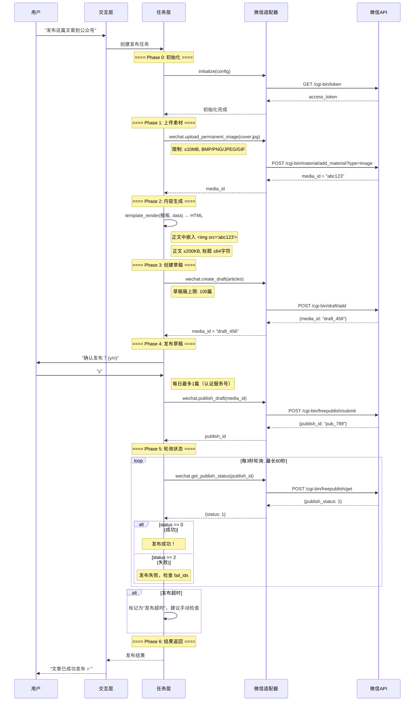

# Layer 4: 执行层（Execution Layer）

> **架构说明**：根据架构评审结论，执行层只包含**平台适配器**。通用工具（http_request, file_read 等）已移至 Layer 1 运行时层。ToolRegistry 统一在 Layer 1 管理，执行层的适配器在初始化时向 Layer 1 ToolRegistry 注册其平台工具。

## 概述

执行层是 Pulsar 中**唯一直接与外部内容平台 API 交互**的层级。通过统一的 PlatformAdapter 抽象，将微信、微博、小红书等平台的 API 差异封装在各自的适配器中。上层（任务层、认知层）无需关心底层平台差异。

执行层分为三个核心子系统：

| 子系统 | 目录 | 职责 |
|--------|------|------|
| **工具框架** | `execution/tools/` | 工具注册、发现、调用生命周期 |
| **基础适配器** | `execution/adapters/base.py` | 平台适配器抽象接口 |
| **微信适配器** | `execution/adapters/wechat/` | 微信公众号平台具体实现 |

---

## 1. 工具框架（execution/tools/）

工具框架是执行层的核心基础设施，负责工具的定义、注册、发现和调用。所有对外暴露的能力都以"工具（Tool）"的形式呈现。

### 1.1 ToolRegistry 类

> **架构说明 (Architecture Note)**：`ToolRegistry` 的实际定义和主实例位于 **Layer 1 Runtime**（`runtime/tool_registry.py`）。Layer 4 执行层**不持有**独立的 ToolRegistry 实例，其平台适配器（如 WeChatAdapter）在初始化时通过 PIP 向 Layer 1 ToolRegistry 注册平台特定的工具。Layer 4 仅维护平台适配器内部的工具列表（如 `WeChatAdapter._tools`），调用时由 Layer 3 Orchestrator 通过 PIP 委托给 Layer 1 ToolRegistry 执行。请勿在 Layer 4 创建第二个 ToolRegistry 实例。

`ToolRegistry` 是工具注册中心，维护全局工具映射表。

```
┌─────────────────────────────────────┐
│           ToolRegistry              │
│  ┌───────────────────────────────┐  │
│  │  _tools: dict[str, BaseTool]  │  │
│  │  _aliases: dict[str, str]     │  │
│  └───────────────────────────────┘  │
│                                     │
│  register()   → 注册工具             │
│  get()        → 按名称获取工具        │
│  list()       → 列出所有工具          │
│  execute()    → 按名称执行工具        │
└─────────────────────────────────────┘
```

#### 方法签名

```python
class ToolRegistry:
    """工具注册中心——单例模式"""

    def __init__(self):
        self._tools: dict[str, BaseTool] = {}
        self._aliases: dict[str, str] = {}

    def register(self, tool: BaseTool) -> None:
        """注册一个工具实例到注册表。

        参数:
            tool: BaseTool 子类实例，使用 tool.name 作为键
        抛出:
            ValueError: 如果工具名称已存在
        """
        if tool.name in self._tools:
            raise ValueError(f"工具 '{tool.name}' 已注册")
        self._tools[tool.name] = tool

    def get(self, name: str) -> BaseTool | None:
        """按名称获取已注册的工具。

        支持别名查找：先查 _tools，再查 _aliases。
        参数:
            name: 工具名称或别名
        返回:
            找到返回 BaseTool 实例，否则返回 None
        """
        tool = self._tools.get(name)
        if tool is None:
            aliased = self._aliases.get(name)
            if aliased:
                tool = self._tools.get(aliased)
        return tool

    def list(self, include_hidden: bool = False) -> list[ToolDefinition]:
        """列出所有已注册的工具定义。

        参数:
            include_hidden: 是否包含隐藏工具（如内部调试工具）
        返回:
            ToolDefinition 列表，每个包含 name, description, input_schema
        """
        tools = []
        for name, tool in self._tools.items():
            if not include_hidden and tool.name.startswith("_"):
                continue
            tools.append(ToolDefinition(
                name=tool.name,
                description=tool.description,
                input_schema=tool.input_schema,
            ))
        return tools

    async def execute(self, name: str, **kwargs) -> Any:
        """按名称执行工具。

        参数:
            name: 工具名称
            **kwargs: 工具参数，需符合工具的 input_schema
        返回:
            工具执行结果
        抛出:
            KeyError: 工具未注册
            ValidationError: 参数校验失败
            ToolExecutionError: 执行过程中出错
        """
        tool = self.get(name)
        if tool is None:
            raise KeyError(f"工具 '{name}' 未注册，可用工具: {list(self._tools.keys())}")
        return await tool.execute(**kwargs)
```

### 1.2 BaseTool 抽象类

所有工具必须继承 `BaseTool` 并实现 `execute()` 方法。

```python
from abc import ABC, abstractmethod
from pydantic import BaseModel, Field

class BaseTool(ABC):
    """所有工具的抽象基类。

    子类必须设置类属性并实现 execute() 方法。
    """

    # === 元数据（子类必须定义） ===
    name: str = ""                      # 工具名称，全局唯一
    description: str = ""               # 工具描述，供 LLM 理解用途
    input_schema: dict = {}              # JSON Schema，用于参数校验
    output_schema: dict = {}             # JSON Schema，用于结果校验

    # === 生命周期 ===
    def __init__(self):
        """初始化工具实例。子类可在此加载依赖。"""
        self._validate_metadata()

    def _validate_metadata(self) -> None:
        """验证元数据完整性。"""
        if not self.name:
            raise ValueError(f"{type(self).__name__} 必须设置 name")
        if not self.description:
            raise ValueError(f"{type(self).__name__} 必须设置 description")
        if not self.input_schema:
            raise ValueError(f"{type(self).__name__} 必须设置 input_schema")

    # === 核心方法 ===
    @abstractmethod
    async def execute(self, **kwargs) -> Any:
        """执行工具逻辑。

        参数:
            **kwargs: 由 input_schema 校验后的参数
        返回:
            符合 output_schema 的结果
        抛出:
            ToolExecutionError: 执行失败时抛出
        """
        ...

    # === 辅助方法 ===
    def to_definition(self) -> ToolDefinition:
        """转换为 LLM 可用的工具定义格式。"""
        return ToolDefinition(
            name=self.name,
            description=self.description,
            input_schema=self.input_schema,
        )

    def validate_args(self, **kwargs) -> dict:
        """使用 JSON Schema 校验参数。

        返回:
            校验后的参数字典（可能包含默认值填充后的结果）
        抛出:
            ValidationError: 参数不符合 schema
        """
        # 使用 jsonschema 或 pydantic 进行校验
        from jsonschema import validate as js_validate
        js_validate(kwargs, self.input_schema)
        return kwargs
```

### 1.3 @tool 装饰器模式

提供声明式注册方式，将普通函数快速转换为工具。

```python
from functools import wraps
from typing import Callable, Any

# 全局工具注册表实例
_registry = ToolRegistry()

def tool(
    name: str | None = None,
    description: str = "",
    input_schema: dict | None = None,
    output_schema: dict | None = None,
    auto_register: bool = True,
) -> Callable:
    """将异步函数装饰为工具并自动注册。

    用法:
        @tool(name="http_request", description="发送 HTTP 请求")
        async def my_http_request(url: str, method: str = "GET") -> dict:
            ...

    参数:
        name: 工具名称，默认使用函数名
        description: 工具描述
        input_schema: 输入 JSON Schema，默认从函数签名推导
        output_schema: 输出 JSON Schema
        auto_register: 是否自动注册到全局注册表
    返回:
        装饰器函数
    """
    def decorator(func: Callable) -> Callable:
        tool_name = name or func.__name__
        schema = input_schema or _infer_schema_from_signature(func)

        class DecoratedTool(BaseTool):
            name = tool_name
            description = description or func.__doc__ or ""
            input_schema = schema
            output_schema = output_schema or {}

            async def execute(self, **kwargs) -> Any:
                return await func(**kwargs)

        instance = DecoratedTool()

        if auto_register:
            _registry.register(instance)

        @wraps(func)
        async def wrapper(**kwargs) -> Any:
            return await instance.execute(**kwargs)

        wrapper._tool = instance
        return wrapper

    return decorator


def _infer_schema_from_signature(func: Callable) -> dict:
    """从函数签名推导 JSON Schema。"""
    import inspect
    sig = inspect.signature(func)
    properties = {}
    required = []

    for param_name, param in sig.parameters.items():
        if param_name == "self" or param_name == "cls":
            continue
        prop = _type_to_schema(param.annotation)
        if param.default is inspect.Parameter.empty:
            required.append(param_name)
        else:
            prop["default"] = param.default
        properties[param_name] = prop

    return {
        "type": "object",
        "properties": properties,
        "required": required,
    }


def _type_to_schema(annotation: type) -> dict:
    """Python 类型到 JSON Schema 类型的映射。"""
    mapping = {
        str:   {"type": "string"},
        int:   {"type": "integer"},
        float: {"type": "number"},
        bool:  {"type": "boolean"},
        dict:  {"type": "object"},
        list:  {"type": "array"},
        bytes: {"type": "string", "contentEncoding": "base64"},
    }
    return mapping.get(annotation, {"type": "string"})
```

### 1.4 内置工具

以下是执行层内置的标准工具，所有工具的 input_schema 均遵循 JSON Schema Draft-07 规范。

---

#### 1.4.1 http_request — HTTP 请求工具

```python
@tool(
    name="http_request",
    description="发送 HTTP 请求到指定 URL，支持 GET/POST/PUT/DELETE 方法，"
                "可自定义请求头、请求体和超时时间。适用于调用外部 REST API。",
    input_schema={
        "type": "object",
        "properties": {
            "url": {
                "type": "string",
                "description": "请求目标 URL（必须包含协议，如 https://api.example.com/v1）",
                "examples": ["https://api.weixin.qq.com/cgi-bin/token"]
            },
            "method": {
                "type": "string",
                "description": "HTTP 请求方法",
                "enum": ["GET", "POST", "PUT", "DELETE", "PATCH", "HEAD"],
                "default": "GET"
            },
            "headers": {
                "type": "object",
                "description": "自定义请求头（键值对）",
                "default": {},
                "examples": [{"Content-Type": "application/json"}]
            },
            "body": {
                "type": ["object", "string", "null"],
                "description": "请求体。当 Content-Type 为 application/json 时自动序列化",
                "default": None
            },
            "timeout": {
                "type": "integer",
                "description": "请求超时时间（秒）",
                "default": 30,
                "minimum": 1,
                "maximum": 300
            },
            "params": {
                "type": "object",
                "description": "URL 查询参数（键值对）",
                "default": {}
            }
        },
        "required": ["url"]
    },
    output_schema={
        "type": "object",
        "properties": {
            "status_code": {"type": "integer", "description": "HTTP 状态码"},
            "headers": {"type": "object", "description": "响应头"},
            "body": {"type": ["object", "string", "null"], "description": "响应体（JSON 自动解析）"},
            "elapsed_ms": {"type": "integer", "description": "请求耗时（毫秒）"}
        }
    }
)
async def http_request(
    url: str,
    method: str = "GET",
    headers: dict | None = None,
    body: dict | str | None = None,
    timeout: int = 30,
    params: dict | None = None,
) -> dict:
    """发送 HTTP 请求。

    依赖: httpx 或 aiohttp 库。

    返回示例:
        {"status_code": 200, "headers": {...}, "body": {...}, "elapsed_ms": 234}

    限制:
        - 最大响应体: 10MB
        - 不支持文件流式上传（使用素材上传工具）
        - 自动跟随 301/302 重定向（最多 5 次）
    """
    import httpx
    import time

    headers = headers or {}
    params = params or {}

    # 自动设置 Content-Type
    if body is not None and "Content-Type" not in headers:
        if isinstance(body, dict):
            headers["Content-Type"] = "application/json"
            import json
            body = json.dumps(body)

    start = time.monotonic()
    async with httpx.AsyncClient(timeout=timeout, follow_redirects=True) as client:
        response = await client.request(
            method=method,
            url=url,
            headers=headers,
            content=body,
            params=params,
        )

    elapsed = int((time.monotonic() - start) * 1000)

    # 尝试解析 JSON 响应体
    try:
        result_body = response.json()
    except Exception:
        result_body = response.text

    return {
        "status_code": response.status_code,
        "headers": dict(response.headers),
        "body": result_body,
        "elapsed_ms": elapsed,
    }
```

> **性能/伸缩性设计要点**：`http_request` 工具本身是纯 I/O 操作，使用 `httpx.AsyncClient` 异步执行即可。但对于 **CPU-bound 图像处理操作**（如 `image_process` 工具中的缩放、裁剪、格式转换等 Pillow 操作），应使用 `asyncio.get_running_loop().run_in_executor()` 配合 `ThreadPoolExecutor` 将 CPU 密集型工作卸载到线程池中，避免阻塞事件循环。

```python
import asyncio
from concurrent.futures import ThreadPoolExecutor

# 全局线程池（与 asyncio 事件循环共享）
_image_executor = ThreadPoolExecutor(max_workers=4)

async def image_process_resize(source_path: str, width: int, height: int) -> dict:
    """CPU 密集型图片缩放——卸载到线程池执行"""
    loop = asyncio.get_running_loop()

    def _sync_resize():
        from PIL import Image
        with Image.open(source_path) as img:
            img_resized = img.resize((width, height), Image.LANCZOS)
            output_path = source_path  # 原地覆盖
            img_resized.save(output_path)
            return {
                "output_path": output_path,
                "width": img_resized.width,
                "height": img_resized.height,
                "format": img_resized.format or "unknown",
            }

    return await loop.run_in_executor(_image_executor, _sync_resize)
```

**关键规则**：
- 所有 Pillow 图像处理（`Image.open`, `resize`, `crop`, `rotate`, `convert`, `filter`, `save` 等）均应在 `run_in_executor` 中执行。
- 使用 **全局 `ThreadPoolExecutor`** 实例（而非每次创建新的），避免线程创建/销毁开销。`max_workers` 建议 = CPU 核心数 × 2。
- 线程池在 `image_process` 工具初始化时创建，在系统关闭时统一释放。
- 对于小文件（< 100KB 图像或纯元数据读取），可同步执行以规避线程上下文切换开销。

**使用示例：**

```
输入:
  url: "https://api.weixin.qq.com/cgi-bin/token"
  params: {"grant_type": "client_credential", "appid": "wx...", "secret": "..."}
输出:
  {"status_code": 200, "body": {"access_token": "72...", "expires_in": 7200}, "elapsed_ms": 156}
```

---

#### 1.4.2 file_read — 文件读取工具

```python
@tool(
    name="file_read",
    description="读取本地文件内容，支持偏移量和大小限制，适用于读取文本文件和媒体文件元数据。",
    input_schema={
        "type": "object",
        "properties": {
            "path": {
                "type": "string",
                "description": "文件路径（绝对路径或相对于 data_dir 的相对路径）"
            },
            "offset": {
                "type": "integer",
                "description": "读取起始偏移量（字节），用于分段读取大文件",
                "default": 0,
                "minimum": 0
            },
            "limit": {
                "type": "integer",
                "description": "最大读取字节数，-1 表示读取到文件末尾",
                "default": -1,
                "minimum": -1,
                "maximum": 10485760  # 10MB
            }
        },
        "required": ["path"]
    },
    output_schema={
        "type": "object",
        "properties": {
            "content": {"type": "string", "description": "文件内容（文本）"},
            "size": {"type": "integer", "description": "文件总大小（字节）"},
            "encoding": {"type": "string", "description": "文件编码（自动检测）"},
            "mime_type": {"type": "string", "description": "文件 MIME 类型"}
        }
    }
)
async def file_read(path: str, offset: int = 0, limit: int = -1) -> dict:
    """读取本地文件。

    限制:
        - 最大读取大小: 10MB
        - 仅支持文本文件和 JSON 文件
        - 默认编码检测: UTF-8 → GBK → Latin-1
        - 路径穿越防护：不允许读取 data_dir 之外的文件（除非使用绝对路径且配置文件允许）
    """
    ...
```

---

#### 1.4.3 file_write — 文件写入工具

```python
@tool(
    name="file_write",
    description="将内容写入本地文件，支持文本和 JSON 格式。自动创建父目录。",
    input_schema={
        "type": "object",
        "properties": {
            "path": {
                "type": "string",
                "description": "文件路径（绝对路径或相对于 data_dir 的相对路径）"
            },
            "content": {
                "type": ["string", "object"],
                "description": "写入内容。如果是 dict/object，自动序列化为 JSON（indent=2）"
            },
            "encoding": {
                "type": "string",
                "description": "文件编码",
                "default": "utf-8",
                "enum": ["utf-8", "gbk", "latin-1", "ascii"]
            }
        },
        "required": ["path", "content"]
    },
    output_schema={
        "type": "object",
        "properties": {
            "path": {"type": "string", "description": "写入的完整路径"},
            "size": {"type": "integer", "description": "写入字节数"},
            "encoding": {"type": "string", "description": "实际使用的编码"}
        }
    }
)
async def file_write(path: str, content: str | dict, encoding: str = "utf-8") -> dict:
    """写入本地文件。

    限制:
        - 不允许覆盖系统关键文件（通过黑名单检测 /etc/, /proc/, /sys/ 等）
        - 写入大小上限: 50MB
        - 自动创建不存在的父目录
    """
    ...
```

---

#### 1.4.4 json_parse — JSON 解析工具

```python
@tool(
    name="json_parse",
    description="解析 JSON 字符串为结构化数据。支持宽松模式（容许多种常见格式错误）。",
    input_schema={
        "type": "object",
        "properties": {
            "text": {
                "type": "string",
                "description": "待解析的 JSON 字符串"
            },
            "strict": {
                "type": "boolean",
                "description": "严格模式（标准 JSON）或宽松模式（允许 trailing commas、单引号、注释等）",
                "default": False
            }
        },
        "required": ["text"]
    },
    output_schema={
        "type": "object",
        "properties": {
            "data": {"description": "解析后的结构化数据"},
            "success": {"type": "boolean", "description": "是否解析成功"},
            "error": {"type": ["string", "null"], "description": "解析失败时的错误信息"}
        }
    }
)
async def json_parse(text: str, strict: bool = False) -> dict:
    """解析 JSON 字符串。

    宽松模式支持的扩展语法:
        - 末尾逗号: {"a": 1,}
        - 单引号: {'a': 1}
        - 注释: // 和 /* */
        - 无引号 key: {a: 1}
        - 多行字符串
    依赖: 宽松模式使用 demjson3 或 commentjson 库
    """
    ...
```

---

#### 1.4.5 image_process — 图片处理工具

```python
@tool(
    name="image_process",
    description="对图片进行处理，支持裁剪、缩放、旋转、格式转换、添加水印等操作。"
                "适用于上传前预处理封面图和素材。",
    input_schema={
        "type": "object",
        "properties": {
            "action": {
                "type": "string",
                "description": "处理操作类型",
                "enum": [
                    "resize",        # 缩放（指定宽高）
                    "resize_fit",    # 适应（保持比例，完全显示）
                    "resize_fill",   # 填充（保持比例，裁剪多余）
                    "crop",          # 裁剪（指定区域）
                    "rotate",        # 旋转（指定角度）
                    "flip",          # 翻转（水平/垂直）
                    "convert",       # 格式转换
                    "watermark",     # 添加水印
                    "compress",      # 压缩（指定质量）
                    "info",          # 获取图片信息（不修改）
                ]
            },
            "params": {
                "type": "object",
                "description": "处理参数，不同 action 使用不同的参数结构",
                "properties": {
                    "source_path": {
                        "type": "string",
                        "description": "源图片路径（所有 action 均需要）"
                    },
                    "output_path": {
                        "type": "string",
                        "description": "输出路径（不指定则覆盖源文件，格式转换时建议指定）"
                    },
                    # resize
                    "width": {"type": "integer", "description": "目标宽度（像素）"},
                    "height": {"type": "integer", "description": "目标高度（像素）"},
                    # crop
                    "x": {"type": "integer", "description": "裁剪起始 x"},
                    "y": {"type": "integer", "description": "裁剪起始 y"},
                    # rotate
                    "degrees": {"type": "number", "description": "旋转角度（度）"},
                    # convert
                    "format": {
                        "type": "string",
                        "description": "目标格式",
                        "enum": ["JPEG", "PNG", "WebP", "GIF", "BMP"]
                    },
                    # compress
                    "quality": {
                        "type": "integer",
                        "description": "压缩质量 (1-100)，数字越小压缩越狠",
                        "minimum": 1,
                        "maximum": 100,
                        "default": 85
                    },
                    # watermark
                    "watermark_text": {"type": "string", "description": "水印文字"},
                    "watermark_position": {
                        "type": "string",
                        "enum": ["center", "northwest", "northeast", "southwest", "southeast"],
                        "default": "southeast"
                    },
                },
                "required": ["source_path"]
            }
        },
        "required": ["action", "params"]
    },
    output_schema={
        "type": "object",
        "properties": {
            "output_path": {"type": "string", "description": "输出文件路径"},
            "width": {"type": "integer", "description": "处理后的图片宽度（像素）"},
            "height": {"type": "integer", "description": "处理后的图片高度（像素）"},
            "format": {"type": "string", "description": "处理后的图片格式"},
            "size_bytes": {"type": "integer", "description": "处理后的文件大小（字节）"}
        }
    }
)
async def image_process(action: str, params: dict) -> dict:
    """图片处理。

    依赖: Pillow (PIL) 库
    支持的输入格式: JPEG, PNG, GIF, WebP, BMP, TIFF
    限制:
        - 最大输入分辨率: 4096×4096 像素
        - 最大输入文件大小: 50MB
        - watermark 操作仅支持文字水印（图片水印预留）
    """
    ...
```

---

#### 1.4.6 template_render — 模板渲染工具

```python
@tool(
    name="template_render",
    description="使用 Jinja2 模板引擎渲染文本模板，将数据填充到模板中。"
                "适用于生成文章正文、图文消息、自定义消息格式。",
    input_schema={
        "type": "object",
        "properties": {
            "template": {
                "type": "string",
                "description": "Jinja2 模板字符串，支持 {{ var }} 变量插值、"
                               " 循环、 条件判断等"
            },
            "data": {
                "type": "object",
                "description": "模板变量数据，键值对形式"
            },
            "trim_blocks": {
                "type": "boolean",
                "description": "是否删除模板标签后的第一个换行",
                "default": True
            },
            "lstrip_blocks": {
                "type": "boolean",
                "description": "是否删除模板标签前的空白",
                "default": True
            }
        },
        "required": ["template", "data"]
    },
    output_schema={
        "type": "object",
        "properties": {
            "result": {"type": "string", "description": "渲染后的文本"},
            "used_variables": {
                "type": "array",
                "items": {"type": "string"},
                "description": "模板中实际使用的变量列表"
            }
        }
    }
)
async def template_render(
    template: str,
    data: dict,
    trim_blocks: bool = True,
    lstrip_blocks: bool = True,
) -> dict:
    """渲染 Jinja2 模板。

    依赖: jinja2 库
    安全限制:
        - 禁用 , ,  等文件操作标签
        - 禁用 {{ __class__ }}, {{ __globals__ }} 等 Python 内部属性访问
        - 自动转义 HTML 特殊字符（可通过 safe 过滤器关闭）
    """
    ...
```

**使用示例：**

```
模板:
  "标题：{{ title }}\n作者：{{ author }}\n\n{{ content }}"
数据:
  {"title": "宇宙的灯塔", "author": "Pulsar", "content": "脉冲星是一种..."}
输出:
  {"result": "标题：宇宙的灯塔\n作者：Pulsar\n\n脉冲星是一种...",
   "used_variables": ["title", "author", "content"]}
```

---

### 1.5 工具注册流程

```
┌──────────┐    ┌──────────────┐    ┌────────────┐
│  @tool   │───▶│  BaseTool    │───▶│ ToolRegistry│
│ 装饰器    │    │  子类实例     │    │ .register() │
└──────────┘    └──────────────┘    └──────┬─────┘
                                           │
                              ┌────────────▼─────┐
                              │   PIPBus 加载     │
                              │  tools/list       │
                              │  tools/call       │
                              └──────────────────┘
```

1. 工具通过 `@tool` 装饰器或显式 `ToolRegistry.register()` 注册
2. 系统启动时自动扫描 `execution/tools/builtins/` 目录
3. PIPBus 的 `tools/list` 返回所有注册工具的定义
4. PIPBus 的 `tools/call` 委托给 `ToolRegistry.execute()` 执行

---

## 2. 基础适配器（execution/adapters/base.py）

基础适配器定义了所有平台适配器必须遵循的抽象接口。

### 2.1 BasePlatformAdapter 抽象基类

```python
from abc import ABC, abstractmethod
from dataclasses import dataclass, field
from typing import Any


@dataclass
class ToolDefinition:
    """工具定义，供上层（Task Layer / MCP）消费。"""
    name: str                                    # 工具名称（如 "wechat.publish_draft"）
    description: str                             # 工具描述
    input_schema: dict                           # 输入参数的 JSON Schema
    output_schema: dict = field(default_factory=dict)  # 输出结果的 JSON Schema
    category: str = ""                           # 工具分类（如 "wechat", "auth"）


class BasePlatformAdapter(ABC):
    """所有平台适配器的抽象基类。

    每个适配器对应一个社交媒体平台，提供登录、发布、素材管理等能力。
    """

    # === 元数据（子类覆盖） ===
    name: str = ""                       # 适配器名称（如 "wechat_official"）
    platform: str = ""                   # 平台标识（如 "wechat"）

    @abstractmethod
    async def initialize(self, config: dict) -> bool:
        """初始化适配器。

        包括：加载配置、建立连接、验证凭据。
        参数:
            config: 来自 pulsar.yaml 的适配器配置节
        返回:
            True 表示初始化成功
        抛出:
            AdapterInitError: 初始化失败
        """
        ...

    @abstractmethod
    async def get_tools(self) -> list[ToolDefinition]:
        """返回此适配器提供的所有工具定义列表。

        返回的每个 ToolDefinition 对应一个可被 PIPBus 调用的工具。
        返回:
            ToolDefinition 列表
        """
        ...

    @abstractmethod
    async def handle_tool_call(self, tool_name: str, arguments: dict) -> Any:
        """处理工具调用请求。

        参数:
            tool_name: 工具名称（由 get_tools() 返回）
            arguments: 工具参数，已通过 JSON Schema 校验
        返回:
            工具执行结果
        抛出:
            ToolExecutionError: 工具执行失败
            AdapterAuthError: 认证失效（触发重新登录）
        """
        ...
```

### 2.2 适配器生命周期

```
┌──────────┐     ┌──────────────┐     ┌──────────────┐     ┌──────────┐
│  create  │────▶│  initialize  │────▶│   running    │────▶│ shutdown │
│  实例化    │     │  加载配置     │     │  提供服务      │     │  清理     │
└──────────┘     └──────────────┘     └──────┬───────┘     └──────────┘
                                             │
                                    ┌────────▼────────┐
                                    │  RateLimiter    │
                                    │  (透明限频)       │
                                    └─────────────────┘
```

- **create**: 通过配置动态创建适配器实例
- **initialize**: 加载平台配置、获取初始 Token、建立连接
- **running**: 通过 `handle_tool_call()` 处理请求，内部集成 RateLimiter
- **shutdown**: 清理连接、持久化 Token 缓存

---

## 3. 微信适配器（execution/adapters/wechat/）

微信公众号平台适配器是 Phase 1 唯一实现的平台适配器，支持完整的文章发布流程。

### 目录结构

```
execution/adapters/wechat/
├── __init__.py          # 导出 WeChatAdapter
├── adapter.py           # 适配器主类
├── auth.py              # Token 管理器
├── tools.py             # 22+ 工具函数实现
└── models.py            # API 响应模型
```

---

### 3.1 adapter.py — WeChatAdapter 主类

```python
class WeChatAdapter(BasePlatformAdapter):
    """微信公众号平台适配器。

    支持能力:
        - Token 自动获取与刷新
        - 草稿箱管理（创建/编辑/删除/发布）
        - 永久素材管理（图片/音频/视频/缩略图）
        - 临时素材管理
        - 发布管理（发布/删除/状态查询/定时发布）
        - 数据统计（阅读量/点赞/转发）
        - 粉丝管理（标签/黑名单）
        - 菜单管理
        - 自定义回复

    微信 API 限制（截至 2026 年）:
        - 草稿箱: 最多 100 篇草稿
        - 永久素材: 图片 10000 张, 音频 1000 个, 视频 1000 个
        - 临时素材: 有效期 3 天
        - 发布频率: 每日最多 1 篇（服务号认证后）
        - Token: 有效期 7200 秒, 每日获取上限 2000 次
        - 模板消息: 每月最多 10 万条（认证服务号）
        - 素材上传大小: 图片 ≤ 10MB, 音频 ≤ 200MB, 视频 ≤ 10MB
    """

    name = "wechat_official"
    platform = "wechat"
    _tools: list[BaseTool] = []
    _token_manager: WeChatTokenManager | None = None

    async def initialize(self, config: dict) -> bool:
        """初始化微信适配器。

        配置结构（对应 pulsar.yaml 的 adapters.wechat）:
            credentials:
                app_id: str          # 微信 AppID
                app_secret: str      # 微信 AppSecret
                token: str           # 服务器配置 Token（可选）
                encoding_aes_key: str # 加解密密钥（可选）
            token:
                auto_refresh: bool   # 是否自动刷新 Token
                refresh_ahead_seconds: int  # 提前刷新时间
                storage: str         # 存储方式
            network:
                proxy: str           # 代理地址
                connect_timeout: int  # 连接超时
                read_timeout: int    # 读取超时
        """
        # 1. 验证配置完整性
        # 2. 创建 Token 管理器
        # 3. 初始化工具列表
        # 4. 尝试验证 Token 有效性
        ...

    async def get_tools(self) -> list[ToolDefinition]:
        """返回所有微信工具定义。"""
        ...

    async def handle_tool_call(self, tool_name: str, arguments: dict) -> Any:
        """路由工具调用到对应的工具函数。

        路由规则: tool_name 的格式为 "wechat.<action>"，
        例如 "wechat.create_draft" → self._tools["create_draft"].execute()
        """
        ...
```

### 3.2 auth.py — WeChatTokenManager 认证管理器

```python
import time
import asyncio
import json
import logging
from cryptography.fernet import Fernet


class WeChatTokenManager:
    """微信 Access Token 管理器。

    职责:
        - 使用 AppID + AppSecret 获取 access_token
        - 自动在 Token 过期前刷新
        - 支持加密持久化存储
        - 提供 get_stable_token() 获取稳定 Token（微信稳定模式接口）
    微信 API:
        - 获取 Token: GET /cgi-bin/token
        - 稳定 Token: POST /cgi-bin/stable_token

    Token 有效期: 7200 秒（2 小时）
    每日获取上限: 2000 次
    """

    def __init__(
        self,
        app_id: str,
        app_secret: str,
        base_url: str = "https://api.weixin.qq.com",
        auto_refresh: bool = True,
        refresh_ahead: int = 300,       # 提前 5 分钟刷新
        storage: str = "memory",         # memory | file | encrypted_file
        encrypt_key: str | None = None,
        storage_path: str | None = None,
    ):
        self._app_id = app_id
        self._app_secret = app_secret
        self._base_url = base_url
        self._auto_refresh = auto_refresh
        self._refresh_ahead = refresh_ahead
        self._storage = storage
        self._lock = asyncio.Lock()
        self._refresh_task: asyncio.Task | None = None

        # 内部状态
        self._token: str | None = None
        self._expires_at: float = 0.0   # Unix timestamp

        # 加密存储
        self._cipher = None
        if storage == "encrypted_file" and encrypt_key:
            key = self._derive_key(encrypt_key)
            self._cipher = Fernet(key)

        self._logger = logging.getLogger(f"{__name__}.WeChatTokenManager")

    async def initialize(self) -> bool:
        """初始化 Token 管理器。

        流程:
            1. 尝试从持久化存储加载 Token
            2. 验证 Token 是否有效（未过期）
            3. 如果无效或不存在，调用 get_token() 获取新 Token
            4. 如果 auto_refresh=True，启动后台刷新任务
        """
        # 尝试加载本地缓存的 Token
        loaded = await self._load_token()
        if loaded and self._expires_at > time.time() + 60:
            self._logger.info("从持久化存储恢复 Token，有效期至 %s",
                              time.strftime('%Y-%m-%d %H:%M:%S',
                                            time.localtime(self._expires_at)))
        else:
            # 获取新 Token
            await self.get_token(force=True)

        # 启动自动刷新
        if self._auto_refresh:
            self._start_auto_refresh()

        return self._token is not None

    async def get_token(self, force: bool = False) -> str:
        """获取 access_token。

        参数:
            force: 是否强制从 API 获取（忽略缓存）
        返回:
            access_token 字符串
        抛出:
            WeChatAuthError: 获取失败（如 AppID/AppSecret 错误）
            WeChatRateLimitError: 超出每日获取上限
        """
        async with self._lock:
            # 如果 Token 仍然有效且不强制刷新，直接返回缓存
            if not force and self._token and self._expires_at > time.time():
                return self._token

            # 调用微信 API 获取新 Token
            import httpx

            async with httpx.AsyncClient() as client:
                response = await client.get(
                    f"{self._base_url}/cgi-bin/token",
                    params={
                        "grant_type": "client_credential",
                        "appid": self._app_id,
                        "secret": self._app_secret,
                    }
                )
                data = response.json()

            if "access_token" not in data:
                err = data.get("errmsg", "未知错误")
                errcode = data.get("errcode", -1)
                if errcode in (40001, 40002, 40125):
                    raise WeChatAuthError(f"认证失败: {err} (errcode={errcode})")
                elif errcode == 45009:
                    raise WeChatRateLimitError(f"超出每日获取上限: {err}")
                else:
                    raise WeChatAuthError(f"获取 Token 失败: {err} (errcode={errcode})")

            self._token = data["access_token"]
            self._expires_at = time.time() + data.get("expires_in", 7200)

            # 持久化存储
            await self._save_token()

            return self._token

    async def get_stable_token(self, force: bool = False) -> str:
        """使用稳定模式获取 Token（更可靠的接口）。

        稳定模式特点:
            - 短时间内多次请求，返回相同的 Token
            - 适用于高并发场景
            - 通过 POST 方式调用
        """
        async with self._lock:
            if not force and self._token and self._expires_at > time.time():
                return self._token

            import httpx

            async with httpx.AsyncClient() as client:
                response = await client.post(
                    f"{self._base_url}/cgi-bin/stable_token",
                    json={
                        "grant_type": "client_credential",
                        "appid": self._app_id,
                        "secret": self._app_secret,
                        "force_refresh": force,
                    }
                )
                data = response.json()

            if "access_token" not in data:
                raise WeChatAuthError(f"获取稳定 Token 失败: {data.get('errmsg', '未知')}")

            self._token = data["access_token"]
            self._expires_at = time.time() + data.get("expires_in", 7200)
            await self._save_token()
            return self._token

    def _start_auto_refresh(self):
        """启动后台自动刷新任务。"""
        async def refresh_loop():
            while True:
                # 计算下次刷新时间（在过期前 refresh_ahead 秒）
                sleep_time = max(1, (self._expires_at - self._refresh_ahead) - time.time())
                await asyncio.sleep(sleep_time)

                try:
                    self._logger.info("自动刷新 Token...")
                    await self.get_token(force=True)
                    self._logger.info("Token 刷新成功")
                except Exception as e:
                    self._logger.error(f"Token 自动刷新失败: {e}")
                    # 重试间隔 30 秒
                    await asyncio.sleep(30)

        self._refresh_task = asyncio.create_task(refresh_loop())

    async def _save_token(self):
        """持久化保存 Token。"""
        if self._storage == "memory":
            return

        token_data = {
            "token": self._token,
            "expires_at": self._expires_at,
            "updated_at": time.time(),
        }

        if self._storage == "file" or self._storage == "encrypted_file":
            path = self._storage_path or "./data/wechat/token_cache.json"
            import os
            os.makedirs(os.path.dirname(path), exist_ok=True)

            data_str = json.dumps(token_data)
            if self._cipher:
                data_str = self._cipher.encrypt(data_str.encode()).decode()

            with open(path, "w") as f:
                f.write(data_str)

    async def _load_token(self) -> bool:
        """从持久化存储加载 Token。"""
        if self._storage == "memory":
            return False

        path = self._storage_path or "./data/wechat/token_cache.json"
        try:
            with open(path) as f:
                data_str = f.read()

            if self._cipher:
                data_str = self._cipher.decrypt(data_str.encode()).decode()

            token_data = json.loads(data_str)
            self._token = token_data["token"]
            self._expires_at = token_data["expires_at"]
            return True
        except (FileNotFoundError, json.JSONDecodeError, Exception):
            return False

    async def shutdown(self):
        """关闭 Token 管理器，取消刷新任务。"""
        if self._refresh_task:
            self._refresh_task.cancel()
            try:
                await self._refresh_task
            except asyncio.CancelledError:
                pass
        await self._save_token()

    def _derive_key(self, key: str) -> bytes:
        """从用户提供的密码派生出加密密钥。"""
        import hashlib, base64
        # 使用 SHA-256 派生 32 字节密钥
        raw = hashlib.sha256(key.encode()).digest()
        return base64.urlsafe_b64encode(raw)
```

### 3.3 tools.py — 22+ 个微信工具函数

微信适配器提供 22+ 个工具，覆盖微信公众号所有 API 能力。

#### 工具总览

| 序号 | 工具名称 | 类别 | 说明 |
|------|---------|------|------|
| 1 | `wechat.create_draft` | 草稿 | 创建图文草稿 |
| 2 | `wechat.get_draft` | 草稿 | 获取草稿详情 |
| 3 | `wechat.update_draft` | 草稿 | 修改草稿 |
| 4 | `wechat.delete_draft` | 草稿 | 删除草稿 |
| 5 | `wechat.list_drafts` | 草稿 | 列出草稿列表（分页） |
| 6 | `wechat.publish_draft` | 发布 | 发布草稿（提交发布任务） |
| 7 | `wechat.delete_publish` | 发布 | 删除已发布内容 |
| 8 | `wechat.get_publish_status` | 发布 | 查询发布状态 |
| 9 | `wechat.schedule_publish` | 发布 | 定时发布草稿 |
| 10 | `wechat.list_published` | 发布 | 获取已发布列表 |
| 11 | `wechat.upload_permanent_image` | 素材 | 上传永久图片素材 |
| 12 | `wechat.upload_permanent_audio` | 素材 | 上传永久音频素材 |
| 13 | `wechat.upload_permanent_video` | 素材 | 上传永久视频素材 |
| 14 | `wechat.upload_permanent_thumbnail` | 素材 | 上传永久缩略图素材 |
| 15 | `wechat.upload_temporary_material` | 素材 | 上传临时素材 |
| 16 | `wechat.get_material` | 素材 | 获取永久素材详情 |
| 17 | `wechat.delete_material` | 素材 | 删除永久素材 |
| 18 | `wechat.get_article_stats` | 统计 | 获取单篇图文统计 |
| 19 | `wechat.get_overall_stats` | 统计 | 获取整体数据统计 |
| 20 | `wechat.get_fan_tags` | 粉丝 | 获取粉丝标签列表 |
| 21 | `wechat.create_menu` | 菜单 | 创建自定义菜单 |
| 22 | `wechat.get_auto_reply_rules` | 回复 | 获取自动回复规则 |
| 23 | `wechat.send_template_message` | 消息 | 发送模板消息 |
| 24 | `wechat.get_comment_list` | 评论 | 获取文章评论列表 |

#### 核心工具详细实现

##### wechat.create_draft — 创建图文草稿

```python
@tool(
    name="wechat.create_draft",
    description="创建微信公众号图文草稿。支持单图文和多图文（最多 8 篇）草稿。"
                "注意：草稿创建后需发布才能真正推送给粉丝。",
    input_schema={
        "type": "object",
        "properties": {
            "articles": {
                "type": "array",
                "description": "图文列表，支持 1-8 篇，第一篇为头条",
                "items": {
                    "type": "object",
                    "properties": {
                        "title": {
                            "type": "string",
                            "description": "文章标题（必填，长度 1-64 字符）",
                            "maxLength": 64
                        },
                        "author": {
                            "type": "string",
                            "description": "作者（选填，长度 1-8 字符）",
                            "maxLength": 8
                        },
                        "digest": {
                            "type": "string",
                            "description": "文章摘要（选填，不填则自动从正文截取前 120 字）",
                            "maxLength": 120
                        },
                        "content": {
                            "type": "string",
                            "description": "文章正文 HTML（必填，支持图文混排，"
                                           "图片需使用  引用已上传素材）"
                        },
                        "cover_media_id": {
                            "type": "string",
                            "description": "封面图片素材 media_id（必填，需先上传图片素材）"
                        },
                        "need_open_comment": {
                            "type": "integer",
                            "description": "是否打开评论: 0=关闭, 1=开启",
                            "enum": [0, 1],
                            "default": 0
                        },
                        "only_fans_can_comment": {
                            "type": "integer",
                            "description": "是否仅粉丝可评论: 0=所有人, 1=仅粉丝",
                            "enum": [0, 1],
                            "default": 0
                        },
                        "thumb_media_id": {
                            "type": "string",
                            "description": "封面图片 media_id（已废弃，使用 cover_media_id 替代）"
                        },
                        "need_show_cover": {
                            "type": "integer",
                            "description": "是否在正文中显示封面: 0=不显示, 1=显示",
                            "enum": [0, 1],
                            "default": 1
                        },
                        "content_source_url": {
                            "type": "string",
                            "description": "原文链接 URL",
                            "format": "uri"
                        },
                        "category_id": {
                            "type": "integer",
                            "description": "文章分类 ID"
                        },
                        "pic_crop_235_1": {
                            "type": "string",
                            "description": "封面裁剪坐标（2.35:1 比例），格式: 'x1,y1,x2,y2'"
                        },
                        "pic_crop_1_1": {
                            "type": "string",
                            "description": "封面裁剪坐标（1:1 比例），格式: 'x1,y1,x2,y2'"
                        }
                    },
                    "required": ["title", "content", "cover_media_id"]
                },
                "minItems": 1,
                "maxItems": 8
            },
            "need_free_publish": {
                "type": "integer",
                "description": "是否为草稿箱免费发布（1=使用免费发布次数，0=使用发布次数）",
                "enum": [0, 1],
                "default": 0
            }
        },
        "required": ["articles"]
    },
    output_schema={
        "type": "object",
        "properties": {
            "media_id": {"type": "string", "description": "草稿 media_id"},
            "content": {
                "type": "object",
                "description": "各篇文章的信息",
                "properties": {
                    "item": {
                        "type": "array",
                        "items": {
                            "type": "object",
                            "properties": {
                                "index": {"type": "integer"},
                                "title": {"type": "string"},
                                "digest": {"type": "string"},
                                "article_id": {"type": "string"},
                            }
                        }
                    }
                }
            }
        }
    }
)
async def create_draft(articles: list[dict], need_free_publish: int = 0) -> dict:
    """创建图文草稿。

    微信 API: POST /cgi-bin/draft/add
    文档: https://developers.weixin.qq.com/doc/offiaccount/Draft_Box/Add_draft.html

    限制:
        - 草稿箱最多 100 篇草稿
        - 单篇正文最大 200KB（HTML 格式）
        - 正文中的图片需使用已上传的素材 media_id
        - 多图文最多 8 篇
        - 每日创建草稿无上限（但发布有限额）
    """
    # 参数校验
    if len(articles) < 1 or len(articles) > 8:
        raise ValueError("articles 数量必须在 1-8 之间")
    for i, art in enumerate(articles):
        if len(art.get("title", "")) > 64:
            raise ValueError(f"第 {i+1} 篇文章标题超过 64 字符")
        if len(art.get("author", "")) > 8:
            raise ValueError(f"第 {i+1} 篇文章作者超过 8 字符")

    # 获取有效 Token
    token = await _adapter._token_manager.get_token()

    # 调用微信 API
    result = await http_request(
        url=f"{_adapter._base_url}/cgi-bin/draft/add",
        method="POST",
        params={"access_token": token},
        body={"articles": articles},
    )

    if result["status_code"] != 200:
        raise WeChatAPIError(f"创建草稿失败: {result}")

    body = result["body"]
    if "errcode" in body and body["errcode"] != 0:
        raise WeChatAPIError(f"创建草稿失败: {body.get('errmsg', '未知错误')} "
                            f"(errcode={body['errcode']})")

    return body


# 其余工具函数实现模式类似，省略重复代码...
```

##### wechat.publish_draft — 发布草稿

```python
@tool(
    name="wechat.publish_draft",
    description="将草稿箱中的草稿发布给粉丝。发布操作是异步的，"
                "需通过 get_publish_status 查询最终发布结果。"
                "注意：认证服务号每天只能发布 1 次。",
    input_schema={
        "type": "object",
        "properties": {
            "media_id": {
                "type": "string",
                "description": "草稿的 media_id（通过 create_draft 获得）"
            },
            "speed": {
                "type": "integer",
                "description": "发布速度: 1=普通, 2=快速（需额外开通权限）",
                "enum": [1, 2],
                "default": 1
            }
        },
        "required": ["media_id"]
    },
    output_schema={
        "type": "object",
        "properties": {
            "publish_id": {"type": "string", "description": "发布任务 ID，用于查询发布状态"},
            "msg_data_id": {"type": "string", "description": "消息数据 ID"},
            "status": {"type": "string", "description": "发布状态: 0=成功, 其他=请查询 publish_status"}
        }
    }
)
async def publish_draft(media_id: str, speed: int = 1) -> dict:
    """发布草稿。

    微信 API: POST /cgi-bin/freepublish/submit
    文档: https://developers.weixin.qq.com/doc/offiaccount/Publish/Publish.html

    限制:
        - 认证服务号每日 1 篇（无论单图文还是多图文均计 1 次）
        - 草稿发布为异步操作，需轮询 publish_id 状态
        - 发布成功后不能修改，只能删除后重新发布
        - 草稿发布后草稿本身不会被删除
        - 调用频率: 每日 1000 次
    """
    ...
```

##### wechat.get_publish_status — 查询发布状态

```python
@tool(
    name="wechat.get_publish_status",
    description="查询草稿的发布任务状态。由于发布是异步的，需轮询此接口直到返回成功。",
    input_schema={
        "type": "object",
        "properties": {
            "publish_id": {
                "type": "string",
                "description": "发布任务 ID（publish_draft 返回的 publish_id）"
            }
        },
        "required": ["publish_id"]
    },
    output_schema={
        "type": "object",
        "properties": {
            "publish_status": {
                "type": "string",
                "description": "发布状态: 0=发布成功, 1=正在发布中, 2=发布失败, 3=草稿不可用, 4=审核不通过"
            },
            "article_id": {
                "type": "string",
                "description": "发布成功后的文章 ID（仅 status=0 时有值）"
            },
            "fail_idx": {
                "type": "array",
                "items": {"type": "integer"},
                "description": "发布失败的文章索引（多图文时部分失败）"
            }
        }
    }
)
async def get_publish_status(publish_id: str) -> dict:
    """查询发布状态。

    微信 API: POST /cgi-bin/freepublish/get

    轮询建议:
        - 首次查询: 提交后等待 5 秒
        - 轮询间隔: 3 秒
        - 超时时间: 60 秒（超时后标记为"发布超时"）
    """
    ...
```

##### wechat.upload_permanent_image — 上传永久图片素材

```python
@tool(
    name="wechat.upload_permanent_image",
    description="上传永久图片素材到微信公众号素材库。上传成功后返回 media_id，"
                "可在创建草稿时作为封面或正文图片引用。",
    input_schema={
        "type": "object",
        "properties": {
            "file_path": {
                "type": "string",
                "description": "本地图片文件路径"
            },
            "title": {
                "type": "string",
                "description": "素材标题（视频素材必填）"
            },
            "introduction": {
                "type": "string",
                "description": "素材描述（视频素材选填）"
            }
        },
        "required": ["file_path"]
    },
    output_schema={
        "type": "object",
        "properties": {
            "media_id": {"type": "string", "description": "永久素材 media_id"},
            "url": {"type": "string", "description": "图片 URL（可对外公开）"},
            "size": {"type": "integer", "description": "文件大小（字节）"},
            "width": {"type": "integer", "description": "图片宽度（像素）"},
            "height": {"type": "integer", "description": "图片高度（像素）"}
        }
    }
)
async def upload_permanent_image(file_path: str, title: str = "", introduction: str = "") -> dict:
    """上传永久图片素材。

    微信 API: POST /cgi-bin/material/add_material?type=image
    文档: https://developers.weixin.qq.com/doc/offiaccount/Asset_Management/Permanent_assets/Upload_permanent_assets.html

    限制:
        - 图片格式: BMP, PNG, JPEG, JPG, GIF
        - 图片大小: ≤ 10MB
        - 像素限制: 宽高 ≤ 6000px
        - 数量限制: 图片素材最多 10000 个
        - 支持自动裁剪（上传时微信自动优化）
        - 返回的 url 为永久链接（不会过期）
    """
    ...
```

---

### 3.4 models.py — 微信 API 响应模型

```python
from pydantic import BaseModel, Field
from typing import Optional
from datetime import datetime


class WeChatDraft(BaseModel):
    """微信公众号图文草稿模型。"""
    media_id: str = Field(..., description="草稿的唯一标识符")
    title: str = Field(..., description="文章标题")
    author: str = Field("", description="作者")
    digest: str = Field("", description="文章摘要")
    content: str = Field(..., description="文章正文 HTML")
    cover_media_id: str = Field(..., description="封面素材 media_id")
    need_open_comment: int = Field(0, description="是否打开评论")
    create_time: datetime = Field(..., description="创建时间")
    update_time: datetime = Field(..., description="最后修改时间")
    url: Optional[str] = Field(None, description="草稿预览 URL")


class WeChatPublishResult(BaseModel):
    """微信公众号发布结果模型。"""
    publish_id: str = Field(..., description="发布任务 ID")
    status: int = Field(..., description="发布状态: 0=成功, 1=发布中, 2=失败")
    article_id: Optional[str] = Field(None, description="发布成功后文章 ID")
    fail_idx: list[int] = Field(default_factory=list, description="失败的文章索引")
    publish_time: Optional[datetime] = Field(None, description="实际发布时间")


class WeChatToken(BaseModel):
    """微信 access_token 模型。"""
    access_token: str = Field(..., description="接口调用凭证")
    expires_in: int = Field(7200, description="凭证有效期（秒）")
    acquired_at: float = Field(..., description="获取时间的 Unix 时间戳")


class WeChatMedia(BaseModel):
    """微信素材模型。"""
    media_id: str = Field(..., description="素材唯一标识")
    name: str = Field("", description="文件名")
    url: Optional[str] = Field(None, description="素材 URL")
    size: int = Field(0, description="文件大小（字节）")
    created_at: datetime = Field(..., description="上传时间")
    type: str = Field("image", description="素材类型: image/voice/video/thumb")


class WeChatStats(BaseModel):
    """微信图文统计数据模型。"""
    article_id: str = Field(..., description="文章 ID")
    title: str = Field(..., description="文章标题")
    read_count: int = Field(0, description="阅读次数")
    like_count: int = Field(0, description="点赞数")
    share_count: int = Field(0, description="分享次数")
    collect_count: int = Field(0, description="收藏次数")
    comment_count: int = Field(0, description="评论数")
    date: str = Field(..., description="统计日期（yyyy-mm-dd）")


class WeChatAPIError(BaseModel):
    """微信 API 错误响应模型。"""
    errcode: int = Field(..., description="微信错误码")
    errmsg: str = Field(..., description="错误描述")
```

---

## 4. 端到端发布工作流

以下是完整的微信公众号文章发布流程伪代码，标注了所有限制和注意事项。



### 4.1 完整伪代码实现

```python
# === 任务层编排 ===
class PublishWorkflow:
    """端到端发布工作流。

    限制汇总:
        阶段     |   限制                          |   解决策略
        --------|----------------------------------|-----------------
        素材上传  |   ≤10MB, 仅特定格式               | 预处理缩放+格式转换
        草稿创建  |   草稿箱 ≤100篇                   | 发布后清理旧草稿
        草稿创建  |   正文 ≤200KB, 标题 ≤64字符        | 截断/压缩
        草稿创建  |   多图文 ≤8篇                     | 超量时分批
        发布     |   每日 1 篇                       | 队列+定时发布
        发布     |   异步, 需轮询                    | 指数退避轮询
        Token   |   7200s 过期, 每日 2000 次获取     | 提前刷新+缓存
        频率     |   各接口有独立频率限制              | RateLimiter 全局控制
    """

    async def execute(self, article_data: dict, config: dict) -> PublishResult:
        """
        参数:
            article_data: {
                "title": str,
                "author": str,
                "content": str (HTML),
                "cover_path": str (本地图片路径),
                "digest": str (可选),
                "source_url": str (可选),
                "comment_open": bool,
                "schedule_time": str (可选, "HH:MM")
            }
            config: 微信适配器配置
        返回:
            PublishResult
        """

        # ---- Phase 0: 初始化 ----
        adapter = WeChatAdapter()
        initialized = await adapter.initialize(config)
        if not initialized:
            raise RuntimeError("微信适配器初始化失败")

        # ---- Phase 1: 图片预处理 ----
        # 限制: 微信最大图片 10MB, 支持格式 BMP/PNG/JPEG/GIF
        cover_info = await image_process(
            action="resize_fit",
            params={
                "source_path": article_data["cover_path"],
                "width": 1080,       # 公众号推荐宽度 1080px
                "height": 1920,      # 限制最大高度
            }
        )
        # 进一步压缩确保 ≤ 10MB
        if cover_info["size_bytes"] > 10 * 1024 * 1024:
            cover_info = await image_process(
                action="compress",
                params={
                    "source_path": cover_info["output_path"],
                    "quality": 70,   # 降低质量
                }
            )

        # ---- Phase 2: 上传封面素材 ----
        # 限制: 永久图片素材最多 10000 个
        upload_result = await adapter.handle_tool_call(
            "wechat.upload_permanent_image",
            {"file_path": cover_info["output_path"]}
        )
        cover_media_id = upload_result["media_id"]

        # ---- Phase 3: 内容模板渲染 ----
        # 限制: 正文 HTML ≤200KB
        rendered = await template_render(
            template=article_data["content"],
            data={
                "cover_tag": f'',
                "title": article_data["title"],
            }
        )
        content_html = rendered["result"]

        # 截断过大的正文
        if len(content_html.encode("utf-8")) > 200 * 1024:
            content_html = self._truncate_content(content_html)

        # ---- Phase 4: 创建草稿 ----
        # 限制: 草稿箱最多 100 篇, 标题 ≤64 字符, 多图文 ≤8 篇
        draft_result = await adapter.handle_tool_call(
            "wechat.create_draft",
            {
                "articles": [{
                    "title": article_data["title"][:64],
                    "author": article_data.get("author", "Pulsar")[:8],
                    "content": content_html,
                    "digest": article_data.get("digest", "")[:120],
                    "cover_media_id": cover_media_id,
                    "need_open_comment": 1 if article_data.get("comment_open", True) else 0,
                    "content_source_url": article_data.get("source_url", ""),
                }]
            }
        )
        media_id = draft_result["media_id"]

        # ---- Phase 5: 定时发布检查 ----
        if article_data.get("schedule_time"):
            # 使用定时发布接口（需要额外权限）
            publish_result = await adapter.handle_tool_call(
                "wechat.schedule_publish",
                {
                    "media_id": media_id,
                    "schedule_time": article_data["schedule_time"],
                }
            )
        else:
            # ---- Phase 6: 立即发布 ----
            # 限制: 认证服务号每日 1 篇
            publish_result = await adapter.handle_tool_call(
                "wechat.publish_draft",
                {"media_id": media_id}
            )
            publish_id = publish_result["publish_id"]

            # ---- Phase 7: 轮询发布状态 ----
            status = await self._poll_publish_status(adapter, publish_id)
            if status != 0:
                raise RuntimeError(f"发布失败, 状态码: {status}")

        return PublishResult(success=True, platform_post_id=media_id)

    async def _poll_publish_status(
        self, adapter: WeChatAdapter, publish_id: str, max_wait: int = 60
    ) -> int:
        """轮询发布状态，指数退避。

        微信 API 异步发布建议:
            - 首次查询等待 5 秒
            - 轮询间隔逐步增加: 3s → 5s → 8s → 13s → 21s
            - 最长等待 60 秒
        """
        import asyncio

        delays = [5, 3, 5, 8, 13, 21]
        start = time.time()

        for delay in delays:
            await asyncio.sleep(delay)
            elapsed = time.time() - start
            if elapsed > max_wait:
                return -1  # 超时

            result = await adapter.handle_tool_call(
                "wechat.get_publish_status",
                {"publish_id": publish_id}
            )
            status = result.get("publish_status", -1)
            if status == 0:
                return 0  # 成功
            elif status == 2:
                return 2  # 失败

        return -1  # 超时

    def _truncate_content(self, html: str, max_bytes: int = 200 * 1024) -> str:
        """截断 HTML 内容到指定大小，保留完整标签。"""
        # 实现略：安全的 HTML 截断算法
        ...
```

### 4.2 错误处理与重试策略

```python
# 各阶段的错误处理策略
ERROR_STRATEGIES = {
    # Token 相关错误
    WeChatAuthError: {
        "action": "refresh_token_and_retry",  # 刷新 Token 后重试
        "max_retries": 2,
    },
    WeChatRateLimitError: {
        "action": "wait_and_retry",           # 等待 60 秒后重试
        "delay": 60,
        "max_retries": 3,
    },
    # 网络相关错误
    httpx.TimeoutException: {
        "action": "exponential_backoff",      # 指数退避重试
        "base_delay": 5,
        "max_delay": 60,
        "max_retries": 3,
    },
    # 草稿已存在
    WeChatAPIError: {                        # errcode=45009 等
        "action": "log_and_abort",           # 记录错误并中断
    },
}
```

---

## 5. 限频控制（Rate Limiter）

执行层内置的透明限频机制，确保不触发微信 API 的频率限制。

```python
class RateLimiter:
    """滑动窗口限频器。

    Phase 1 实现: 使用 asyncio.Semaphore + 令牌桶。
    Phase 2 规划: 使用 Redis 实现分布式限频。

    微信 API 频率限制:
        接口              | 限制
        -----------------|----------------------
        /cgi-bin/token   | 每日 2000 次
        /cgi-bin/draft/* | 无明确限制，建议 ≤500次/分钟
        /cgi-bin/freepublish/submit | 每日 1000 次
        /cgi-bin/material/* | 素材上传: 10次/分钟
        所有 API 合计     | 40 次/分钟（IP 级别）
    """

    def __init__(self, max_per_minute: int = 40):
        self._tokens = max_per_minute
        self._rate = max_per_minute
        self._last_refill = time.monotonic()

    async def acquire(self, tokens: int = 1):
        """获取执行许可。"""
        self._refill()
        if self._tokens < tokens:
            wait_time = (tokens - self._tokens) / self._rate * 60
            await asyncio.sleep(wait_time)
            self._refill()
        self._tokens -= tokens

    def _refill(self):
        now = time.monotonic()
        elapsed = now - self._last_refill
        self._tokens = min(self._rate, self._tokens + elapsed / 60 * self._rate)
        self._last_refill = now
```

---

## 6. 配置参考

微信适配器相关配置项（完整配置见 `config-reference.md`）：

```yaml
adapters:
  wechat:
    enabled: true
    base_url: "https://api.weixin.qq.com"
    credentials:
      app_id: "${WECHAT_APP_ID}"          # 必填
      app_secret: "${WECHAT_APP_SECRET}"   # 必填
    token:
      auto_refresh: true
      refresh_ahead_seconds: 300
      storage: "encrypted_file"
    draft:
      max_drafts: 100
      auto_save_interval: 60
      cache_path: "./data/wechat/drafts"
    material:
      upload_timeout: 120
      max_image_bytes: 10485760       # 10 MB
      max_audio_bytes: 52428800       # 50 MB
      max_video_bytes: 104857600      # 100 MB
    publish:
      confirm_before_publish: true
      retry_count: 3
    network:
      proxy: ""
      connect_timeout: 10
      read_timeout: 30
```

---

> **执行层设计核心思想：** 通过"工具化"将每个平台的能力抽象为独立的可调用单元，通过"适配器"封装平台差异。新平台只需实现适配器接口并注册工具，即可无缝接入 Pulsar 系统。Token 管理、限频控制、错误处理等横切关注点由基类和中间件统一处理，适配器开发者只需关注业务逻辑。
