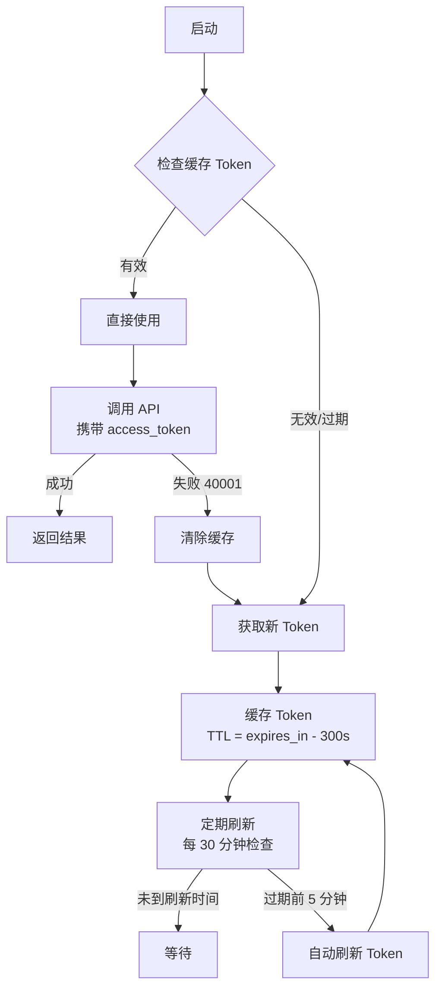

# 微信适配器 (WeChat Adapter) — API 工具参考

> ⚠️ **CRITICAL NOTE：微信 2025 年 7 月限制**：个人/未认证公众号将失去发布 API 权限。部署前请确认公众号认证状态。

## 概述

微信适配器将微信公众平台官方 API 封装为统一的工具接口，供系统内部通过 PIP 协议调用。本文档是完整的 API 工具参考手册。

---

## 一、认证管理 (Auth)

### 1.1 `get_token` — 获取 Access Token

| 字段 | 值 |
|------|-----|
| **HTTP 方法** | GET |
| **微信路径** | `/cgi-bin/token` |
| **必需参数** | `grant_type` (固定为 `client_credential`), `appid`, `secret` |
| **可选参数** | 无 |
| **响应格式** | `{"access_token": "xxx", "expires_in": 7200}` |
| **频率限制** | 2,000 次/天 |
| **备注** | 返回的 token 有效期为 2 小时，务必缓存复用 |

### 1.2 `get_callback_ip` — 获取微信服务器 IP 地址

| 字段 | 值 |
|------|-----|
| **HTTP 方法** | GET |
| **微信路径** | `/cgi-bin/getcallbackip` |
| **必需参数** | 无（需 `access_token` 作为 query 参数） |
| **可选参数** | 无 |
| **响应格式** | `{"ip_list": ["101.226.103.xx", ...]}` |
| **频率限制** | 无明确每日限制 |
| **备注** | 用于配置防火墙白名单，获取微信服务器 IP 列表 |

### 1.3 `get_stable_token` — 获取稳定版 Access Token

| 字段 | 值 |
|------|-----|
| **HTTP 方法** | POST |
| **微信路径** | `/cgi-bin/stable_token` |
| **必需参数** | `grant_type`, `appid`, `secret` |
| **可选参数** | `force_refresh` (bool, 是否强制刷新) |
| **响应格式** | `{"access_token": "xxx", "expires_in": 7200}` |
| **频率限制** | 2,000 次/天 |
| **备注** | 推荐优先使用此接口，支持强制刷新 |

---

## 二、草稿管理 (Draft)

### 2.1 `draft_add` — 新建草稿

| 字段 | 值 |
|------|-----|
| **HTTP 方法** | POST |
| **微信路径** | `/cgi-bin/draft/add` |
| **必需参数** | `articles` (文章内容数组) |
| **可选参数** | 无 |
| **响应格式** | `{"media_id": "xxx"}`, `errcode` 等错误信息 |
| **频率限制** | 无明确每日限制 |
| **备注** | 一次调用最多支持 10 篇文章（多图文） |

### 2.2 `draft_update` — 更新草稿

| 字段 | 值 |
|------|-----|
| **HTTP 方法** | POST |
| **微信路径** | `/cgi-bin/draft/update` |
| **必需参数** | `media_id`, `articles` (索引和内容) |
| **可选参数** | 无 |
| **响应格式** | `{"errcode": 0, "errmsg": "ok"}` |
| **频率限制** | 无明确每日限制 |
| **备注** | 需要指定 `media_id` 和 `index` 来定位要更新的文章 |

### 2.3 `draft_get` — 获取草稿

| 字段 | 值 |
|------|-----|
| **HTTP 方法** | POST |
| **微信路径** | `/cgi-bin/draft/get` |
| **必需参数** | `media_id` |
| **可选参数** | 无 |
| **响应格式** | 文章完整内容（标题、正文、封面等） |
| **频率限制** | 无明确每日限制 |
| **备注** | 返回草稿的完整信息 |

### 2.4 `draft_list` — 获取草稿列表

| 字段 | 值 |
|------|-----|
| **HTTP 方法** | POST |
| **微信路径** | `/cgi-bin/draft/batchget` |
| **必需参数** | `offset` (偏移量), `count` (数量, 1~20) |
| **可选参数** | `no_content` (bool, 是否不返回正文) |
| **响应格式** | `{"total_count": N, "item": [...]}` |
| **频率限制** | 无明确每日限制 |
| **备注** | 分页查询，`count` 最大 20 |

### 2.5 `draft_delete` — 删除草稿

| 字段 | 值 |
|------|-----|
| **HTTP 方法** | POST |
| **微信路径** | `/cgi-bin/draft/delete` |
| **必需参数** | `media_id` |
| **可选参数** | 无 |
| **响应格式** | `{"errcode": 0, "errmsg": "ok"}` |
| **频率限制** | 无明确每日限制 |
| **备注** | 删除后不可恢复 |

> ⚠️ **注意：微信公众平台不存在 `/cgi-bin/draft/switch` 接口。** 草稿发布请使用 **发布管理 (Publish)** 中的 `publish_submit` 工具（见第三章）。`draft_switch` 工具已废弃并移除。

---

## 三、发布管理 (Publish)

### 3.1 `publish_submit` — 提交发布

| 字段 | 值 |
|------|-----|
| **HTTP 方法** | POST |
| **微信路径** | `/cgi-bin/freepublish/submit` |
| **必需参数** | `draft_id` |
| **可选参数** | 无 |
| **响应格式** | `{"publish_id": "xxx"}` |
| **频率限制** | 每日 1 次 |
| **备注** | 异步操作，提交后需轮询发布状态。注意：微信 `/cgi-bin/freepublish/submit` **不接受 `speed` 参数**，旧的 `draft_switch` 工具中的 speed 字段已废弃。 |

### 3.2 `publish_status` — 查询发布状态

| 字段 | 值 |
|------|-----|
| **HTTP 方法** | POST |
| **微信路径** | `/cgi-bin/freepublish/get` |
| **必需参数** | `publish_id` |
| **可选参数** | 无 |
| **响应格式** | `{"publish_status": "success", "article_id": "xxx"}` |
| **频率限制** | 无明确每日限制 |
| **备注** | `publish_status` 可选值: `success`, `fail`, `pending` |

### 3.3 `publish_list` — 已发布文章列表

| 字段 | 值 |
|------|-----|
| **HTTP 方法** | POST |
| **微信路径** | `/cgi-bin/freepublish/batchget` |
| **必需参数** | `offset`, `count` (1~50) |
| **可选参数** | `no_content` (bool) |
| **响应格式** | `{"total_count": N, "item": [...]}` |
| **频率限制** | 无明确每日限制 |
| **备注** | 获取已成功发布的文章 |

### 3.4 `publish_delete` — 删除已发布文章

| 字段 | 值 |
|------|-----|
| **HTTP 方法** | POST |
| **微信路径** | `/cgi-bin/freepublish/delete` |
| **必需参数** | `article_id` |
| **可选参数** | `index` (多图文中的第 N 篇) |
| **响应格式** | `{"errcode": 0, "errmsg": "ok"}` |
| **频率限制** | 无明确每日限制 |
| **备注** | 从公众号删除已发布文章 |

### 3.5 `publish_get_article` — 获取文章详情

| 字段 | 值 |
|------|-----|
| **HTTP 方法** | POST |
| **微信路径** | `/cgi-bin/freepublish/getarticle` |
| **必需参数** | `article_id` |
| **可选参数** | 无 |
| **响应格式** | 文章完整内容 |
| **频率限制** | 无明确每日限制 |
| **备注** | 获取单篇文章的完整详情 |

---

## 四、素材管理 (Material)

### 4.1 `upload_image` — 上传图片素材

| 字段 | 值 |
|------|-----|
| **HTTP 方法** | POST (multipart/form-data) |
| **微信路径** | `/cgi-bin/media/uploadimg` |
| **必需参数** | `media` (文件) |
| **可选参数** | 无 |
| **响应格式** | `{"url": "https://..."}` |
| **频率限制** | 无明确每日限制 |
| **备注** | 上传图片到微信服务器，返回永久图片 URL |

### 4.2 `material_add` — 添加永久素材

| 字段 | 值 |
|------|-----|
| **HTTP 方法** | POST (multipart/form-data) |
| **微信路径** | `/cgi-bin/material/add_material` |
| **必需参数** | `type` (image/video/voice/thumb), `media` (文件) |
| **可选参数** | `description` (视频类型时必需标题和介绍) |
| **响应格式** | `{"media_id": "xxx"}`, 视频类型额外返回 `url` |
| **频率限制** | 永久素材总数 ≤ 100,000 |
| **备注** | 不同类型素材有不同格式和尺寸要求 |

### 4.3 `material_get` — 获取永久素材

| 字段 | 值 |
|------|-----|
| **HTTP 方法** | POST |
| **微信路径** | `/cgi-bin/material/get_material` |
| **必需参数** | `media_id` |
| **可选参数** | 无 |
| **响应格式** | 文件二进制流 或 JSON `{"news_item": [...]}` |
| **频率限制** | 无明确每日限制 |
| **备注** | 图文素材返回 JSON，其余返回文件流 |

### 4.4 `material_list` — 获取素材列表

| 字段 | 值 |
|------|-----|
| **HTTP 方法** | POST |
| **微信路径** | `/cgi-bin/material/batchget_material` |
| **必需参数** | `type` (image/video/voice/news), `offset`, `count` (1~20) |
| **可选参数** | 无 |
| **响应格式** | `{"total_count": N, "item_count": M, "item": [...]}` |
| **频率限制** | 无明确每日限制 |
| **备注** | 分页查询各类型素材 |

### 4.5 `material_delete` — 删除永久素材

| 字段 | 值 |
|------|-----|
| **HTTP 方法** | POST |
| **微信路径** | `/cgi-bin/material/del_material` |
| **必需参数** | `media_id` |
| **可选参数** | 无 |
| **响应格式** | `{"errcode": 0, "errmsg": "ok"}` |
| **频率限制** | 无明确每日限制 |
| **备注** | 删除后不可恢复 |

### 4.6 `temp_upload` — 上传临时素材

| 字段 | 值 |
|------|-----|
| **HTTP 方法** | POST (multipart/form-data) |
| **微信路径** | `/cgi-bin/media/upload` |
| **必需参数** | `type` (image/voice/video/thumb), `media` (文件) |
| **可选参数** | 无 |
| **响应格式** | `{"type": "image", "media_id": "xxx", "created_at": N}` |
| **频率限制** | 无明确每日限制 |
| **备注** | 临时素材有效期为 3 天 |

---

## 五、数据统计 (Stats)

### 5.1 `user_summary` — 用户新增数据

| 字段 | 值 |
|------|-----|
| **HTTP 方法** | POST |
| **微信路径** | `/datacube/getusersummary` |
| **必需参数** | `begin_date`, `end_date` (YYYY-MM-DD) |
| **可选参数** | 无 |
| **响应格式** | `{"list": [{"ref_date": "...", "user_source": N, "new_user": N}]}` |
| **频率限制** | 无明确每日限制 |
| **备注** | 最多查询 7 天跨度 |

### 5.2 `user_cumulate` — 累计用户数据

| 字段 | 值 |
|------|-----|
| **HTTP 方法** | POST |
| **微信路径** | `/datacube/getusercumulate` |
| **必需参数** | `begin_date`, `end_date` |
| **可选参数** | 无 |
| **响应格式** | `{"list": [{"ref_date": "...", "cumulate_user": N}]}` |
| **频率限制** | 无明确每日限制 |
| **备注** | 最多查询 7 天跨度 |

### 5.3 `article_summary` — 图文群发每日数据

| 字段 | 值 |
|------|-----|
| **HTTP 方法** | POST |
| **微信路径** | `/datacube/getarticlesummary` |
| **必需参数** | `begin_date`, `end_date` |
| **可选参数** | 无 |
| **响应格式** | `{"list": [{"ref_date": "...", "int_page_read_user": N}]}` |
| **频率限制** | 无明确每日限制 |
| **备注** | 最多查询 7 天跨度 |

### 5.4 `article_total` — 图文群发总数据

| 字段 | 值 |
|------|-----|
| **HTTP 方法** | POST |
| **微信路径** | `/datacube/getarticletotal` |
| **必需参数** | `begin_date`, `end_date` |
| **可选参数** | 无 |
| **响应格式** | `{"list": [{"ref_date": "...", "int_page_read_user": N}]}` |
| **频率限制** | 无明确每日限制 |
| **备注** | 包含累计阅读/分享数据 |

### 5.5 `article_read` — 图文阅读统计数据

| 字段 | 值 |
|------|-----|
| **HTTP 方法** | POST |
| **微信路径** | `/datacube/getuserread` |
| **必需参数** | `begin_date`, `end_date` |
| **可选参数** | 无 |
| **响应格式** | `{"list": [{"ref_date": "...", "int_page_read_user": N}]}` |
| **频率限制** | 无明确每日限制 |
| **备注** | 阅读来源分析 |

### 5.6 `article_share` — 图文分享统计数据

| 字段 | 值 |
|------|-----|
| **HTTP 方法** | POST |
| **微信路径** | `/datacube/getusershare` |
| **必需参数** | `begin_date`, `end_date` |
| **可选参数** | 无 |
| **响应格式** | `{"list": [{"ref_date": "...", "share_user": N}]}` |
| **频率限制** | 无明确每日限制 |
| **备注** | 分享转发数据 |

### 5.7 `interface` — 接口分析数据

| 字段 | 值 |
|------|-----|
| **HTTP 方法** | POST |
| **微信路径** | `/datacube/getinterfacesummary` |
| **必需参数** | `begin_date`, `end_date` |
| **可选参数** | 无 |
| **响应格式** | `{"list": [{"ref_date": "...", "callback_count": N}]}` |
| **频率限制** | 无明确每日限制 |
| **备注** | 接口调用统计 |

---

## 六、评论管理 (Comment)

### 6.1 `comment_open` — 打开评论

| 字段 | 值 |
|------|-----|
| **HTTP 方法** | POST |
| **微信路径** | `/cgi-bin/comment/open` |
| **必需参数** | `msg_data_id`, `index` |
| **可选参数** | 无 |
| **响应格式** | `{"errcode": 0, "errmsg": "ok"}` |
| **频率限制** | 无明确每日限制 |
| **备注** | 为指定文章开启评论功能 |

### 6.2 `comment_list` — 查看评论

| 字段 | 值 |
|------|-----|
| **HTTP 方法** | POST |
| **微信路径** | `/cgi-bin/comment/list` |
| **必需参数** | `msg_data_id`, `index` |
| **可选参数** | `begin`, `count`, `type` (0=普通, 1=精选) |
| **响应格式** | `{"total": N, "comment": [...]}` |
| **频率限制** | 无明确每日限制 |
| **备注** | 分页获取评论列表 |

### 6.3 `comment_mark` — 精选评论

| 字段 | 值 |
|------|-----|
| **HTTP 方法** | POST |
| **微信路径** | `/cgi-bin/comment/markelect` |
| **必需参数** | `msg_data_id`, `index`, `comment_id` |
| **可选参数** | 无 |
| **响应格式** | `{"errcode": 0, "errmsg": "ok"}` |
| **频率限制** | 无明确每日限制 |
| **备注** | 将评论标记为精选 |

### 6.4 `comment_unmark` — 取消精选

| 字段 | 值 |
|------|-----|
| **HTTP 方法** | POST |
| **微信路径** | `/cgi-bin/comment/unmarkelect` |
| **必需参数** | `msg_data_id`, `index`, `comment_id` |
| **可选参数** | 无 |
| **响应格式** | `{"errcode": 0, "errmsg": "ok"}` |
| **频率限制** | 无明确每日限制 |
| **备注** | 取消评论的精选标记 |

### 6.5 `comment_reply` — 回复评论

| 字段 | 值 |
|------|-----|
| **HTTP 方法** | POST |
| **微信路径** | `/cgi-bin/comment/reply/add` |
| **必需参数** | `msg_data_id`, `index`, `comment_id`, `content` |
| **可选参数** | 无 |
| **响应格式** | `{"errcode": 0, "errmsg": "ok"}` |
| **频率限制** | 无明确每日限制 |
| **备注** | `content` 需符合评论内容规则 |

### 6.6 `comment_delete` — 删除评论

| 字段 | 值 |
|------|-----|
| **HTTP 方法** | POST |
| **微信路径** | `/cgi-bin/comment/delete` |
| **必需参数** | `msg_data_id`, `index`, `comment_id` |
| **可选参数** | 无 |
| **响应格式** | `{"errcode": 0, "errmsg": "ok"}` |
| **频率限制** | 无明确每日限制 |
| **备注** | 删除后不可恢复 |

---

## 七、菜单管理 (Menu)

### 7.1 `menu_create` — 创建菜单

| 字段 | 值 |
|------|-----|
| **HTTP 方法** | POST |
| **微信路径** | `/cgi-bin/menu/create` |
| **必需参数** | `button` (菜单按钮数组) |
| **可选参数** | 无 |
| **响应格式** | `{"errcode": 0, "errmsg": "ok"}` |
| **频率限制** | 无明确每日限制 |
| **备注** | 最多 3 个一级菜单，每个最多 5 个二级菜单 |

### 7.2 `menu_get` — 查询菜单

| 字段 | 值 |
|------|-----|
| **HTTP 方法** | GET |
| **微信路径** | `/cgi-bin/menu/get` |
| **必需参数** | 无 |
| **可选参数** | 无 |
| **响应格式** | `{"menu": {"button": [...]}}` |
| **频率限制** | 无明确每日限制 |
| **备注** | 返回当前菜单配置 |

### 7.3 `menu_delete` — 删除菜单

| 字段 | 值 |
|------|-----|
| **HTTP 方法** | POST |
| **微信路径** | `/cgi-bin/menu/delete` |
| **必需参数** | 无 |
| **可选参数** | 无 |
| **响应格式** | `{"errcode": 0, "errmsg": "ok"}` |
| **频率限制** | 无明确每日限制 |
| **备注** | 删除所有自定义菜单 |

### 7.4 `menu_conditional` — 创建个性化菜单

| 字段 | 值 |
|------|-----|
| **HTTP 方法** | POST |
| **微信路径** | `/cgi-bin/menu/addconditional` |
| **必需参数** | `button`, `matchrule` |
| **可选参数** | 无 |
| **响应格式** | `{"menuid": "xxx"}` |
| **频率限制** | 无明确每日限制 |
| **备注** | `matchrule` 支持性别、地区、标签等条件 |

---

## 八、用户管理 (User)

### 8.1 `get_user_info` — 获取用户基本信息

| 字段 | 值 |
|------|-----|
| **HTTP 方法** | GET |
| **微信路径** | `/cgi-bin/user/info` |
| **必需参数** | `openid` |
| **可选参数** | `lang` (zh_CN / zh_TW / en, 默认 zh_CN) |
| **响应格式** | `{"subscribe": 1, "openid": "xxx", "nickname": "xxx", "sex": 1, "city": "...", "country": "...", "province": "...", "language": "zh_CN", "headimgurl": "https://...", "subscribe_time": N, "unionid": "xxx", "remark": "...", "groupid": N, "tagid_list": [...], "subscribe_scene": "...", "qr_scene": N, "qr_scene_str": "..."}` |
| **频率限制** | 无明确每日限制 |
| **备注** | 已关注用户返回完整信息；未关注用户仅返回 `openid`。通过 UnionID 机制可跨公众号识别同一用户 |

### 8.2 `get_followers` — 获取关注者列表

| 字段 | 值 |
|------|-----|
| **HTTP 方法** | GET |
| **微信路径** | `/cgi-bin/user/get` |
| **必需参数** | 无 |
| **可选参数** | `next_openid` (第一个拉取的 OPENID，默认从头开始) |
| **响应格式** | `{"total": N, "count": N, "data": {"openid": ["..."]}, "next_openid": "..."}` |
| **频率限制** | 无明确每日限制 |
| **备注** | 每次最多拉取 10,000 个关注者。通过 `next_openid` 实现分页 |

---

## 九、群发消息 (Mass Send)

### 9.1 `mass_send_all` — 群发消息给所有用户

| 字段 | 值 |
|------|-----|
| **HTTP 方法** | POST |
| **微信路径** | `/cgi-bin/message/mass/sendall` |
| **必需参数** | `filter` (筛选条件, `is_to_all: true` 发给所有人), `mpnews` / `text` / `image` / `voice` / `video` 等消息体 |
| **可选参数** | `send_ignore_reprint` (bool, 图文消息被判定为转载时是否继续群发) |
| **响应格式** | `{"errcode": 0, "errmsg": "send job submission success", "msg_id": N, "msg_data_id": N}` |
| **频率限制** | 公众号每日最多 1 次（视认证情况） |
| **备注** | 支持按标签筛选群发。`msg_data_id` 用于查询群发状态。**认证订阅号每日 1 次，服务号每月 4 次** |

### 9.2 `mass_send_status` — 查询群发状态

| 字段 | 值 |
|------|-----|
| **HTTP 方法** | POST |
| **微信路径** | `/cgi-bin/message/mass/get` |
| **必需参数** | `msg_id` |
| **可选参数** | 无 |
| **响应格式** | `{"msg_id": N, "msg_status": "SEND_SUCCESS" / "SENDING" / "SEND_FAIL" / "DELETE"}` |
| **频率限制** | 无明确每日限制 |
| **备注** | 轮询查询群发任务状态，`msg_status` 为 `SEND_SUCCESS` 表示发送成功 |

---

## 十、二维码管理 (QR Code)

### 10.1 `create_qr_code` — 创建二维码

| 字段 | 值 |
|------|-----|
| **HTTP 方法** | POST |
| **微信路径** | `/cgi-bin/qrcode/create` |
| **必需参数** | `action_name` (QR_SCENE / QR_STR_SCENE / QR_LIMIT_SCENE / QR_LIMIT_STR_SCENE), `action_info` (场景值) |
| **可选参数** | `expire_seconds` (临时二维码有效时间, 最大 2592000 秒即 30 天) |
| **响应格式** | `{"ticket": "xxx", "expire_seconds": N, "url": "http://weixin.qq.com/q/..."}` |
| **频率限制** | 临时二维码 100,000 个/天；永久二维码 100,000 个（总数限制） |
| **备注** | 永久二维码 (`QR_LIMIT_SCENE` / `QR_LIMIT_STR_SCENE`) 无过期时间，但数量有限。获取 ticket 后可拼接 URL: `https://mp.weixin.qq.com/cgi-bin/showqrcode?ticket=TICKET` |

---

## 十一、Token 管理流程

### Token 生命周期

```
┌───────────────────────────────────────────────────┐
│                 Token 管理流程                      │
│                                                    │
│  启动 ──► 检查缓存 Token ──► 有效？               │
│                              ├── 是 ──► 直接使用   │
│                              └── 否 ──► 获取新 Token│
│                                          │         │
│   ┌──────────────────────────────────────┘         │
│   ▼                                                  │
│  获取 Token (get_token / get_stable_token)          │
│   │                                                  │
│   ▼                                                  │
│  缓存 Token (内存 / Redis)                          │
│   │  TTL = expires_in - 300 (提前 5 分钟刷新)      │
│   ▼                                                  │
│  定期刷新 (Scheduler 每 30 分钟检查一次)            │
│   │                                                  │
│   ▼                                                  │
│  过期前 5 分钟 ──► 自动刷新 Token                   │
│                      │                               │
│                      ▼                               │
│  调用 API (携带 access_token)                        │
│   │                                                  │
│   ├── 成功 ──► 返回结果                              │
│   └── 失败 (40001) ──► 清除缓存 ──► 重新获取       │
│                                                    │
└───────────────────────────────────────────────────┘
```

### Mermaid 图



---

## 十二、Token 加密存储 (Token Encryption)

### 加密方案

Access Token 是微信 API 调用的核心凭证，必须以加密形式持久化存储。采用 **AES-256-GCM + PBKDF2** 方案：

```
plaintext (access_token 字符串)
    │
    ▼
PBKDF2-HMAC-SHA256 ──► 从 encrypt_key 派生出 256-bit AES 密钥
    │                  (salt = 随机 16B, iterations = 600000)
    ▼
AES-256-GCM 加密 ──► nonce (12B 随机) + ciphertext + auth_tag (16B)
    │
    ▼
文件格式: [nonce 12B][salt 16B][ciphertext][auth_tag 16B]
```

### 文件格式详情

| 偏移 | 长度 | 字段 | 说明 |
|------|------|------|------|
| 0 | 12 | nonce | AES-GCM 初始化向量，每次加密随机生成 |
| 12 | 16 | salt | PBKDF2 盐值，每次派生随机生成 |
| 28 | 可变 | ciphertext | 加密后的 access_token 数据 |
| file_end - 16 | 16 | auth_tag | GCM 认证标签，用于完整性校验 |

### 伪代码实现

```python
import os
import hashlib
from cryptography.hazmat.primitives.ciphers.aead import AESGCM
from cryptography.hazmat.primitives.kdf.pbkdf2 import PBKDF2HMAC

# 密钥派生
def _derive_key(encrypt_key: str, salt: bytes) -> bytes:
    kdf = PBKDF2HMAC(
        algorithm=hashlib.sha256,
        length=32,              # 256-bit AES key
        salt=salt,
        iterations=600000,      # OWASP 推荐最小迭代数
    )
    return kdf.derive(encrypt_key.encode("utf-8"))

# 加密
def encrypt_token(access_token: str, encrypt_key: str) -> bytes:
    salt = os.urandom(16)
    key = _derive_key(encrypt_key, salt)
    aesgcm = AESGCM(key)
    nonce = os.urandom(12)
    ciphertext = aesgcm.encrypt(nonce, access_token.encode("utf-8"), None)
    # 格式: nonce(12) + salt(16) + ciphertext + auth_tag(16)
    return nonce + salt + ciphertext

# 解密
def decrypt_token(encrypted: bytes, encrypt_key: str) -> str:
    nonce = encrypted[:12]
    salt = encrypted[12:28]
    ciphertext = encrypted[28:]
    key = _derive_key(encrypt_key, salt)
    aesgcm = AESGCM(key)
    plaintext = aesgcm.decrypt(nonce, ciphertext, None)
    return plaintext.decode("utf-8")
```

### 文件存储

```python
import json
from pathlib import Path

TOKEN_FILE = "./data/wechat/token.enc"

def save_encrypted_token(access_token: str, expires_in: int, encrypt_key: str):
    """加密保存 access_token 及其有效期到文件。"""
    encrypted = encrypt_token(access_token, encrypt_key)
    payload = {
        "data": encrypted.hex(),
        "expires_at": int(time.time()) + expires_in,
        "version": 1,
    }
    Path(TOKEN_FILE).parent.mkdir(parents=True, exist_ok=True)
    Path(TOKEN_FILE).write_text(json.dumps(payload))

def load_encrypted_token(encrypt_key: str) -> tuple[str, int] | None:
    """从加密文件加载 access_token，返回 (token, expires_at) 或 None。"""
    try:
        payload = json.loads(Path(TOKEN_FILE).read_text())
        if payload["expires_at"] < int(time.time()):
            return None  # 已过期
        encrypted = bytes.fromhex(payload["data"])
        token = decrypt_token(encrypted, encrypt_key)
        return token, payload["expires_at"]
    except (FileNotFoundError, json.JSONDecodeError, KeyError, ValueError):
        return None
```

### 损坏恢复策略

| 错误场景 | 检测方式 | 恢复策略 |
|---------|---------|---------|
| 文件被截断 | `len(encrypted) < 28`（不足 nonce+salt） | 删除文件 → 重新获取 Token |
| GCM 认证失败 | `decrypt()` 抛出 `InvalidTag` 异常 | 删除文件 → 重新获取 Token |
| encrypt_key 变更 | PBKDF2 派生成功但 GCM 认证失败 | 记录告警 → 重新获取 Token 并用新密钥重加密 |
| JSON 解析失败 | `json.JSONDecodeError` | 备份损坏文件为 `token.enc.corrupt` → 重新获取 |
| expires_at 字段损坏 | `KeyError` 或值非整数 | 假设立即过期 → 重新获取 |
| 版本不兼容 | `version != 1` | 按对应版本的解密逻辑处理或降级重加密 |

```python
def safe_load_token(encrypt_key: str) -> str | None:
    """带损坏恢复的安全 Token 加载函数。"""
    try:
        result = load_encrypted_token(encrypt_key)
        if result:
            return result[0]
    except Exception as e:
        logger.error(f"Token 加载失败: {e}, 触发恢复流程")
        # 备份损坏文件
        corrupt_path = Path(TOKEN_FILE)
        if corrupt_path.exists():
            corrupt_path.rename(str(corrupt_path) + ".corrupt")
    # 触发重新获取
    return None
```

---

## 十三、错误码映射表

### 微信公共错误码

| 错误码 | 含义 (中文) | 处理建议 |
|--------|-------------|---------|
| `-1` | 系统繁忙 (系统繁忙，此时请开发者稍候再试) | 指数退避重试 (最多 3 次) |
| `0` | 请求成功 | — |
| `40001` | access_token 无效/过期 | 重新获取 access_token 并重试 |
| `40002` | grant_type 不合法 | 检查 grant_type 参数，固定为 `client_credential` |
| `40003` | 不合法的 OpenID | 检查 OpenID 格式和有效性 |
| `40004` | 不合法的媒体文件类型 | 检查素材类型 (image/voice/video/thumb) |
| `40005` | 不合法的文件类型 | 检查上传文件的 MIME 类型 |
| `40006` | 不合法的文件大小 | 检查文件大小是否在微信限制范围内 |
| `40007` | 不合法的 media_id | 验证 media_id 是否有效且属于当前公众号 |
| `40008` | 不合法的消息类型 | 检查消息类型字段的合法性 |
| `40009` | 图片/文件尺寸超出限制 | 压缩图片至微信要求的尺寸 |
| `40010` | 不合法的视频文件大小 | 检查视频文件大小 (≤ 10MB) |
| `40011` | 不合法的视频时长 | 检查视频时长是否在限制内 |
| `40012` | 不合法的音频文件大小 | 检查音频文件大小 (≤ 2MB, 60s) |
| `40013` | 不合法的 AppID | 检查 appid 是否正确配置 |
| `40014` | 不合法的 access_token | 清除缓存后重新获取 |
| `40015` | 不合法的菜单类型 | 检查菜单类型 (click/view/miniprogram 等) |
| `40016` | 不合法的按钮个数 | 一级菜单 ≤ 3 个，二级菜单 ≤ 5 个 |
| `40017` | 不合法的按钮类型 | 检查菜单按钮类型参数 |
| `40018` | 不合法的按钮名称长度 | 按钮名称需 ≤ 16 字节 (约 8 个汉字) |
| `40019` | 不合法的按钮 KEY 长度 | KEY 需 ≤ 128 字节 |
| `40020` | 不合法的按钮 URL 长度 | URL 需 ≤ 256 字节 |
| `40035` | 不合法的参数 | 检查所有请求参数是否符合接口规范 |
| `40039` | 不合法的 URL 长度 | URL 超过微信限制长度 |
| `40048` | 无效的 URL 域名 | 使用的 URL 域名未在公众号后台配置 |
| `40054` | 不合法的子菜单列表 | 子菜单按钮列表格式错误 |
| `40055` | 不合法的子菜单按钮个数 | 子菜单按钮超出数量限制 |
| `40117` | 分组名字不合法 | 检查分组名称格式和长度 |
| `40125` | 不合法的 appsecret | 在公众号后台重新生成并更新 appsecret |
| `40132` | 微信号不合法 | 检查微信号格式 |
| `40137` | 不支持的图片格式 | 使用 JPG/PNG 格式，不支持 GIF |
| `40155` | 请勿添加其他公众号的主页链接 | 去除外链或使用已备案域名 |
| `40163` | 凭证已过期 (code 已被使用) | 引导用户重新授权 |
| `41001` | 缺少 access_token 参数 | 请求中必须包含 access_token |
| `41002` | 缺少 appid 参数 | 请求参数中添加 appid |
| `41003` | 缺少 refresh_token 参数 | 添加 refresh_token 参数 |
| `41004` | 缺少 secret 参数 | 添加 appsecret 参数 |
| `41005` | 缺少多媒体文件数据 | 确保上传了有效的文件内容 |
| `41006` | 缺少 media_id 参数 | 请求参数中添加 media_id |
| `41007` | 缺少子菜单数据 | 检查子菜单数据结构完整性 |
| `41008` | 缺少 oauth code | 引导用户重新点击授权链接 |
| `41009` | 缺少 OpenID | 请求参数中补充 OpenID |
| `42001` | access_token 超时 | 重新获取 (有效期 7200 秒) |
| `42002` | refresh_token 超时 | 重新引导用户授权 |
| `42003` | code 超时 | 重新获取 code (有效期 5 分钟) |
| `43001` | 需要 GET 请求 | 将 HTTP 方法改为 GET |
| `43002` | 需要 POST 请求 | 将 HTTP 方法改为 POST |
| `43004` | 需要接收者关注 | 引导用户先关注公众号 |
| `43005` | 需要好友关系 | 需要互为好友才能操作 |
| `44001` | 多媒体文件为空 | 上传非空的文件数据 |
| `44002` | POST 的数据包为空 | 检查 POST 请求体内容 |
| `44003` | 图文消息内容为空 | 添加文章内容后再提交 |
| `44004` | 文本消息内容为空 | 确保文本消息包含正文 |
| `45001` | 多媒体文件大小超过限制 | 压缩/裁剪文件至微信限制内 |
| `45002` | 消息内容超过限制 | 截断消息内容至限制长度 |
| `45003` | 标题字段超过限制 | 缩短标题 (≤ 64 字符) |
| `45004` | 描述字段超过限制 | 缩短描述内容 |
| `45005` | 链接字段超过限制 | 缩短 URL 长度 |
| `45006` | 图片链接字段超过限制 | 缩短图片 URL |
| `45007` | 语音播放时间超过限制 | 检查音频时长 (≤ 60s) |
| `45008` | 图文消息超过限制 | 减少文章数量 (≤ 10 篇) |
| `45009` | 接口调用超过频率限制 | 暂停请求，等待限流窗口重置 |
| `45010` | 创建菜单个数超过限制 | 删除部分菜单后再创建 |
| `45011` | API 调用频率超限 | 降低调用频率 |
| `45015` | 回复时间超过限制 | 在 5 秒内回复消息 |
| `45016` | 系统分组不能修改 | 系统分组 (未分组/黑名单) 不可修改 |
| `45017` | 分组名字过长 | 分组名 ≤ 30 字符 |
| `45047` | 客服接口下行条数超过上限 | 等待客服额度刷新 |
| `45157` | 标签名非法 | 检查标签名称 (≤ 30 字符) |
| `45158` | 标签名已存在 | 使用其他标签名称 |
| `45159` | 标签数量超过限制 | 每个公众号最多 100 个标签 |
| `46001` | 不存在媒体数据 | 检查 media_id 是否有效 |
| `46002` | 不存在的菜单版本 | 重新创建菜单 |
| `46003` | 不存在的菜单数据 | 菜单数据未找到，请先创建 |
| `46004` | 不存在的用户 | 用户标识 (OpenID) 无效 |
| `47001` | 解析 JSON/XML 内容错误 | 检查请求体数据格式 |
| `48001` | api 功能未授权 | 检查公众号是否开通对应权限 |
| `48002` | 粉丝拒绝接收消息 | 用户关闭了接收消息开关 |
| `48003` | 预览信息不在服务器白名单 | 将预览微信号加入 IP 白名单 |
| `48004` | api 接口被封禁 | 联系微信客服解封 |
| `48005` | api 禁止删除被自动抓取的信息 | 该内容受保护不可删除 |
| `48006` | api 禁止清零调用次数 | 调用次数不可手动重置 |
| `50001` | 用户未关注公众号 | 引导用户先关注再操作 |
| `50002` | 用户不在该分组 | 检查用户所属分组 ID |
| `61451` | 参数错误 (invoke) | 检查调用参数是否符合接口规范 |
| `61452` | 无效的客服账号 | 检查客服账号是否存在 |
| `61453` | 客服帐号尚未绑定微信号 | 先在后台绑定微信号 |
| `61500` | 日期格式错误 | 使用 `YYYY-MM-DD` 格式 |
| `61501` | 日期范围错误 | 检查日期范围 (最多 7 天) |
| `65301` | 不合法的评论 ID | 检查 comment_id 是否有效 |
| `65302` | 文章已经关闭评论 | 先调用 `comment_open` 开启评论 |
| `65303` | 评论数已达上限 | 清理旧评论或等待释出 |
| `65304` | 评论不存在 | 检查评论是否已被删除 |
| `65305` | 回复超过长度限制 | 缩短回复内容 (≤ 150 字) |
| `65306` | 评论已关闭评论回复 | 该文章评论回复功能已关闭 |
| `65307` | 回复被系统拦截 | 检查内容是否含敏感词 |
| `87009` | 无效的签名 | 检查 JS-SDK 签名算法和参数 |
| `88000` | 草稿已成功发布 | 无需重复提交 |
| `88001` | 草稿不存在 | 检查 draft_id 是否正确 |
| `88002` | 草稿不可被发布 | 草稿状态不允许发布，检查审核状态 |
| `89501` | 该 IP 调用 tyep 命令次数超限 | 降低调用频率 |
| `89503` | 管理员 IP 限制 | 将服务器 IP 添加到公众号 IP 白名单 |
| `89506` | 该公众号已被屏蔽 | 联系微信客服处理 |
| `89507` | 该公众号已倒闭 | 公众号已被注销 |
| `9001001` | POST 数据参数不合法 | 检查 POST 请求体的 JSON 格式 |
| `9001002` | 远端服务不可用 | 等待服务恢复后重试 |
| `9001003` |  Ticket 不合法 | 重新获取 ticket |
| `9001004` | 获取摇周边用户信息失败 | 重试获取用户信息 |
| `9001005` | 获取商户信息失败 | 检查商户信息配置 |
| `9001006` | 获取 OpenID 失败 | 检查授权流程 |
| `9001007` | 上传文件缺失 | 确保上传了文件 |
| `9001008` | 上传素材的文件类型不合法 | 检查文件 MIME 类型 |
| `9001009` | 上传素材的文件尺寸不合法 | 检查文件大小限制 |

### 错误处理策略

| 错误码范围 | 处理策略 | 说明 |
|-----------|---------|------|
| `-1` | 重试 (指数退避, 最多 3 次) | 500ms → 1s → 2s 间隔重试 |
| `0` | 成功，无需处理 | 请求成功完成 |
| `40001`, `40014`, `42001`, `42003` | 清除 Token 缓存并重新获取 | 使用 `get_token` 或 `get_stable_token` 刷新 |
| `40003`, `40007`, `46001`, `46004`, `65301`, `65304` | 检查资源 ID 有效性 | 终止重试，记录日志并通知用户 |
| `40125`, `40013` | 检查应用凭证配置 | 在公众号后台核对 appid/appsecret |
| `4xxxx` (非特殊处理) | 参数错误，终止重试，记录日志 | 检查请求参数格式和内容 |
| `43001` | 切换 HTTP 方法为 GET | 请求方法误用 |
| `43002`, `41005`, `41006`, `44001`, `44002` | 检查请求数据完整性 | 补充缺失的参数或数据 |
| `45009`, `45011`, `89501` | 限流，等待 Retry-After 后重试 | 降低调用频率，建议缓存结果 |
| `45015` | 优化响应速度 | 确保在 5 秒内回复 |
| `48xxx` | 权限不足，终止操作 | 检查 API 权限和白名单配置 |
| `5xxxx` | 用户状态异常 | 引导用户完成前置条件 |
| `87xxx`, `88xxx` | 素材/草稿状态异常 | 检查素材或草稿的当前状态 |
| `89503` | IP 白名单限制 | 将服务器 IP 添加到公众号 IP 白名单 |
| `9xxxxxx` | 微信服务端错误 | 重试 (指数退避) 或联系微信客服 |
